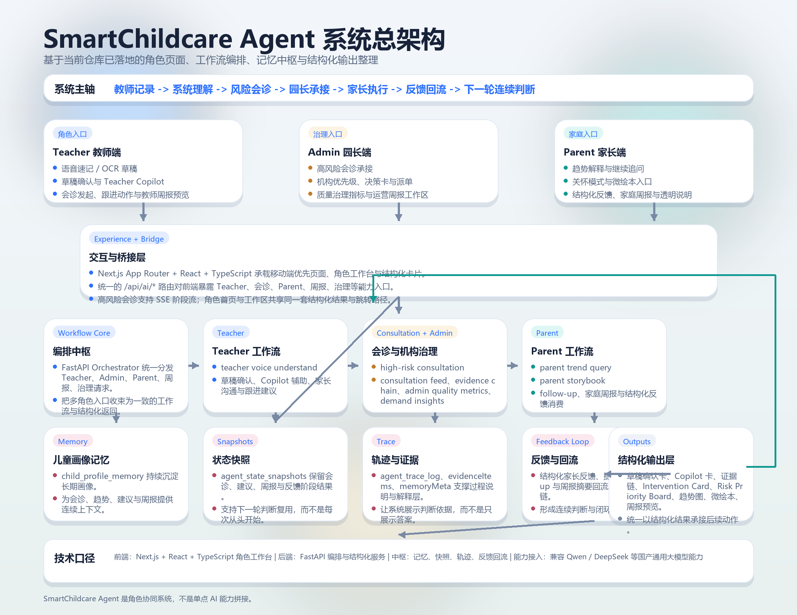
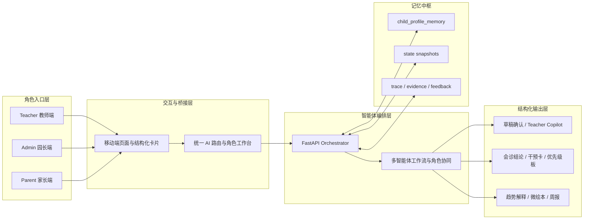
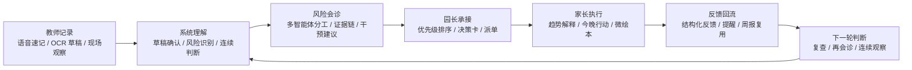
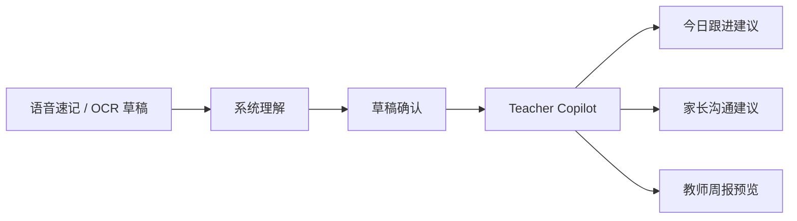
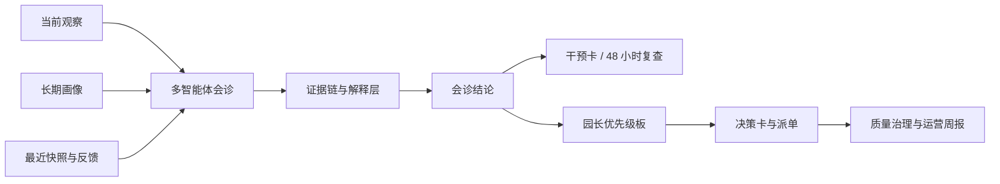
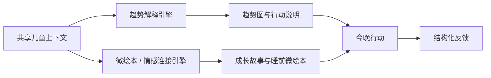
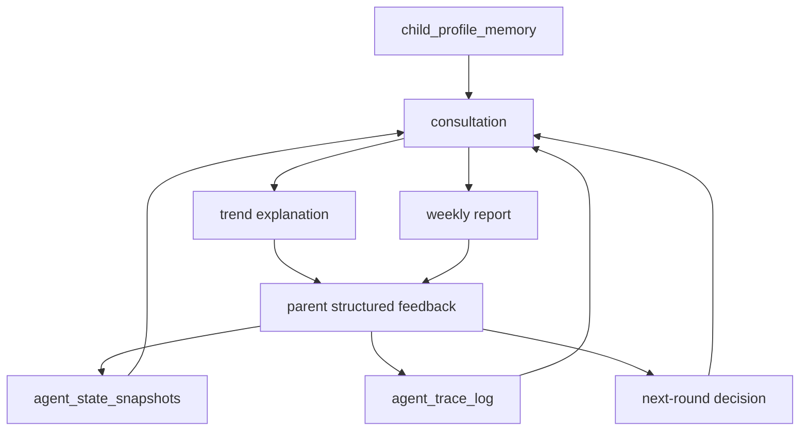

# SmartChildcare Agent

> 面向托育场景的多角色、多智能体、移动端优先协同决策系统。  
> 它的核心目标不是生成一段回答，而是把教师记录、风险会诊、园长承接、家长执行与反馈回流，组织成持续工作的智能闭环。



## 项目价值与问题定义

托育场景真正困难的部分，从来不是“有没有数据”，而是**数据能否进入连续判断与行动闭环**。

在真实机构里，问题通常出现在以下几处：

- 教师观察高度碎片化，很多高价值现场信息来不及形成结构化记录。
- 家园沟通容易停留在单次通知，缺少围绕同一儿童、同一问题的连续协作。
- 风险判断和机构承接经常断层，个体问题难以及时升级到园长视角。
- 家长执行之后，反馈往往难以稳定回流，导致系统下一轮判断仍然像“第一次见面”。
- 普通后台系统擅长记账，普通聊天式 AI 擅长回答，但都不足以支撑托育现场需要的持续判断、分层协同与后续追踪。

SmartChildcare Agent 聚焦的不是“再加一个 AI 功能”，而是把托育现场最关键的这条链路跑通：

**教师记录 -> 系统理解 -> 风险会诊 -> 园长承接 -> 家长执行 -> 反馈回流 -> 下一轮判断**

这决定了它不是一个展示型聊天工具，也不是一个仅靠单次问答成立的产品，而是一套面向真实协同关系设计的系统。

## 项目整体定位

SmartChildcare Agent 是一套围绕教师、园长、家长三类角色协同运行的托育智能体系统。  
它的价值，不在于某一个页面“看起来像 AI”，而在于系统内部已经形成了明确的角色入口、工作流编排、记忆回流与结构化承接关系。

从系统定位上看，它具备五个明确特征：

- `Multi-Agent`：理解、会诊、建议、治理与反馈消费不是单一问答，而是可分工的工作流。
- `Mobile-first`：交互优先服务竖屏、单屏、短链路任务，不把复杂流程强行堆成桌面报表。
- `Memory-driven`：儿童画像、状态快照、会诊轨迹与反馈信号构成连续判断底座。
- `Structured decision-making`：输出草稿卡、证据链、干预卡、优先级板、趋势图和周报，而不是只输出一段长文本。
- `Closed-loop collaboration`：教师、园长、家长围绕同一问题形成链式承接，而不是各看各的页面。

## 为什么它不是“聊天框外挂”

这个项目之所以更接近一个完整系统，而不是一个叠加 AI 的页面组合，原因在于：

- 角色入口不是共用同一聊天界面，而是围绕不同职责设计成教师、园长、家长三条主任务流。
- AI 不只负责生成内容，还负责把输入组织成会诊、跟进、派单、周报和反馈等可执行对象。
- 记忆不是用于“润色回答”，而是用于让下一轮判断真实消费上一轮观察与执行结果。
- 家长侧不是信息展示终点，而是执行和反馈的正式输入端。
- 园长侧不是报表终点，而是把个体问题上升为机构级优先级和治理动作的承接面。

## 系统总图（PNG 版）

上图用于首屏快速理解系统完整度，适合答辩展示、海报复用和 README 总览。  
图中重点强调五层关系：

- 角色入口层：教师、园长、家长三类核心用户。
- 交互与桥接层：移动端页面、角色工作台、统一 AI 路由。
- 智能体编排层：围绕 Teacher、会诊、Parent、周报与治理的工作流编排。
- 记忆中枢：儿童画像、状态快照、轨迹与结构化反馈。
- 输出层：草稿确认、证据链、干预卡、优先级板、趋势解释、微绘本与周报。

这张 PNG 不是装饰图，而是对仓库当前真实系统关系的图像化整理。对应生成脚本位于：

- `scripts/generate_readme_architecture_png.py`

## 系统总架构



从逻辑上看，系统可以分为五层：

### 1. 角色入口层

- 教师侧负责输入现场观察、确认草稿、发起跟进或会诊。
- 园长侧负责机构级优先级、决策承接、派单和治理视角。
- 家长侧负责理解趋势、执行家庭动作、查看成长故事并提交反馈。

### 2. 交互与桥接层

- 前端以移动端优先的角色页面和结构化卡片为主，不把复杂链路压成一条无限长聊天记录。
- `Next.js` 路由层把前端交互统一收束到 `/api/ai/*` 能力入口。
- 同一条角色链路可以在首页、工作台和专项页面之间跳转，而不需要重新组织上下文。

### 3. 智能体编排层

- `FastAPI Orchestrator` 负责把不同任务映射到 Teacher、会诊、Parent、周报、治理等具体服务。
- 编排层的目标不是“调用模型”，而是把角色输入转换成稳定的结构化结果。
- 高风险会诊、家长趋势、微绘本、周报、治理指标都由编排层汇总上下文后产生结果。

### 4. 记忆中枢

- `child_profile_memory` 沉淀长期画像。
- `agent_state_snapshots` 沉淀各轮关键阶段结果。
- `agent_trace_log` 与证据链保留判断过程与来源线索。
- 结构化反馈让家长执行结果重新进入趋势、会诊和周报链路。

### 5. 结构化输出层

- 教师看到的是草稿确认、Copilot 补全、跟进动作与沟通建议。
- 园长看到的是风险优先级、证据链、决策卡、治理指标与运营周报。
- 家长看到的是趋势解释、行动建议、微绘本、反馈表单与家庭周报。

## 多角色闭环



这条闭环是 README 的核心。  
它意味着教师输入不是终点，家长反馈也不是终点；每一轮记录、解释、执行和回流，都会变成下一轮判断的输入。

## 三条主展示主链

### 1. Teacher 智能体主链

教师侧的目标不是增加填表负担，而是把“现场观察”尽快压缩为可确认、可跟进、可协作的结构化输入。

- 支持语音速记与 OCR 草稿，降低现场记录门槛。
- 系统先完成理解与草稿化，再由教师确认，而不是要求教师先写完完整记录。
- Teacher Copilot 会补充记录完善提示、30 秒 SOP 和家长沟通话术。
- 同一工作区继续承接今日跟进行动、家长沟通建议与班级周报预览。
- 教师侧不仅是输入入口，也是后续会诊和家长协作的起点。



这一主链体现的是“先捕捉，再理解，再执行”的逻辑。  
它把教师从纯记录角色，提升成了被系统持续增强的专业协作角色。

### 2. 高风险会诊与园长决策主链

高风险会诊不是把一段提示词包装成结果页，而是把**当前观察、历史画像、最近上下文与多智能体分工**收束成可承接的结构化决策链。

- 会诊过程支持阶段式流转，适合展示“如何得出结论”，而不只是展示最终结论。
- 证据链界面把来源、置信度、人工复核需求和支撑关系显式可见。
- 会诊结果沉淀为园内动作、今晚家庭任务与 48 小时复查点。
- 园长侧进一步承接为风险优先级、决策卡、派单动作与治理视角。
- Admin 首页同时存在“今日优先级”和“机构治理”双视角，不让系统只停留在个体事件响应上。



这条主链体现的是机构级的判断闭环：不仅知道“谁需要关注”，还知道“为什么、谁来承接、后续如何追踪”。

### 3. Parent 双引擎主链

家长侧不是附属页面，而是系统闭环中承担“理解、执行、反馈”三种责任的正式角色。

- 一条链负责趋势解释，把近 7/14/30 天变化转成可理解、可行动的说明。
- 一条链负责情感连接，把成长亮点、今晚任务和会诊上下文组织成微绘本。
- 关怀模式为祖辈或低数字熟练度照护者提供更短链路、更大字、更少决策负担的首屏体验。
- 结构化反馈把执行结果重新写回系统，进入下一轮趋势判断、会诊和周报。
- 家庭周报预览让家长看到“本周发生了什么”与“接下来应该做什么”。



Parent 双引擎的意义不在于“内容更丰富”，而在于系统同时处理理性解释与情感连接，让家长既愿意看，也看得懂、做得下去。

## 记忆中枢与反馈回流

SmartChildcare Agent 的关键差异，在于它不是一次性问答，而是一个持续消费上下文的系统。

- `child_profile_memory` 沉淀儿童长期画像。
- `agent_state_snapshots` 保留各轮理解、会诊、跟进与周报结果。
- `agent_trace_log` 与证据链让系统保留过程信息，而不是只有答案。
- 家长结构化反馈会回流到趋势解释、会诊判断、周报摘要与后续提醒。
- 年龄分层照护策略已经开始接入 Teacher、Parent 与干预建议主链，使建议不再是泛儿童化表达。



系统真正积累的不是“回答”，而是**判断上下文**。  
这也是它更接近智能体系统，而不是单次内容生成工具的原因。

## 结构化输出与可解释性

项目的输出设计强调可承接、可追踪、可解释，而不是只追求生成效果。

| 面向角色 | 典型输出 | 系统意义 |
| --- | --- | --- |
| Teacher | 草稿确认卡、补全提示、微培训 SOP、家长沟通话术 | 把观察转成可执行工作流 |
| Consultation | 总结卡、证据链、Follow-up 卡、Intervention Card | 把风险判断转成结构化决策 |
| Admin | Risk Priority Board、决策卡、派单入口、治理指标、运营周报 | 把个体问题升级成机构级承接 |
| Parent | 趋势解释卡、趋势图、今晚行动、微绘本、反馈表单、家庭周报 | 把“愿意看”转成“做得下去并能回流” |

解释层还会显式保留以下信息：

- `source`
- `dataQuality`
- `warnings`
- `memoryMeta`
- 证据链与结构化 supports 关系

这些元信息的作用，不是削弱系统，而是让系统更容易被审阅、被理解、被信任。

## 技术栈与工程实现

本项目的技术栈描述不追求“堆名词”，而是强调每一层真实承担什么职责。

### 前端体验层

- 使用 `Next.js App Router`、`React`、`TypeScript` 作为主要前端框架。
- 前端不是一个统一聊天页，而是按角色拆分为 Teacher、Admin、Parent 三类页面与工作区。
- UI 组织方式以移动端任务流、结构化卡片、角色工作台和跳转承接为主。
- 已落地的页面主链包括：
  - `/teacher`
  - `/teacher/agent`
  - `/teacher/high-risk-consultation`
  - `/admin`
  - `/admin/agent`
  - `/parent`
  - `/parent/storybook`
  - `/parent/agent`

前端在角色体验上已经形成几个清晰特征：

- 教师侧强调“草稿确认”而不是“先填完表单”。
- 园长侧强调“先看优先级，再决定推进什么”。
- 家长侧强调“先理解今晚做什么，再决定是否继续追问”。

### AI 桥接与路由层

前端与后端之间不是直接散乱调用，而是通过统一的 AI 路由层完成桥接。

- 统一入口为 `/api/ai/*`。
- 角色页通过该层访问 Teacher 理解、会诊、Parent 趋势、微绘本、周报和反馈能力。
- 会诊链路支持 SSE 流式事件，让阶段式过程可以直接被页面消费。
- 页面和工作区之间共用结构化结果，而不是每跳一页就丢失上下文。

这层的意义不是“代理请求”，而是把不同角色的交互统一成一套稳定的工作流边界。

### 后端编排与工作流层

后端核心由 `FastAPI` 与工作流编排服务承担。

当前仓库中，编排层已经覆盖的关键能力包括：

- Teacher 语音理解与 Copilot 辅助
- 高风险会诊与流式阶段输出
- Parent 趋势解释
- Parent 微绘本生成与媒体状态组织
- Teacher / Admin / Parent 三角色周报链路
- Admin 质量治理指标
- 需求洞察聚合

从职责上看，编排层做的不是简单的模型代理，而是：

- 统一收口角色输入
- 组织记忆上下文
- 产出结构化结果
- 把结果继续写入快照、轨迹或下一轮工作流

### 记忆、状态与数据层

系统的连续性建立在一套明确的状态与记忆结构上。

- `child_profile_memory`：沉淀长期画像。
- `agent_state_snapshots`：保留每轮关键工作流输出。
- `agent_trace_log`：保留推理轨迹与阶段事件。
- `MemoryService`：负责跨工作流读写与统一访问。
- 前端本地 store 与草稿持久化：负责移动端草稿、提醒、角色视图联动。
- 结构化反馈与提醒：把执行信号从家长侧重新注入系统。

这意味着系统不是围绕“单轮 prompt”设计，而是围绕“连续判断”设计。

### 结构化合同与共享模型

项目的一个关键工程特点，是大量能力都不是以自由文本形式互相传递，而是依赖结构化合同。

当前 README 可以明确成立的结构化锚点包括：

- 会诊证据链 `evidenceItems`
- 干预卡 `InterventionCard`
- 家长结构化反馈记录
- 三角色行动化周报
- 年龄分层上下文 `ageBandContext`
- 趋势响应中的 `source / dataQuality / warnings`

这类共享合同的价值在于：

- 页面能稳定承接结果，而不是靠字符串解析。
- 周报、会诊、反馈之间能够复用同一批信号。
- 系统更容易做可解释性、治理指标和连续回流。

### 流式展示、解释层与治理能力

项目的“智能感”并不只来自生成结果，更来自过程和治理层。

- 高风险会诊支持流式阶段展示，用户能够看到过程推进，而不是只看到结论。
- 证据链把来源、置信度、人工复核需求和支撑关系显式展示出来。
- Admin 首页除了风险优先级，还新增质量治理区和周报预览，形成治理第二视角。
- 需求洞察引擎开始聚合家长关注点、执行难点、会诊触发热区等机构级问题。

这使系统不仅能“回答”，还能被用来做管理、复盘和决策承接。

### 多模态与内容能力接入

项目在能力接入上采用保守而兼容的口径：  
兼容国产通用大模型能力接入，支持 `Qwen / DeepSeek` 等模型能力用于结构化推理、多模态理解与内容生成。

在当前代码事实范围内，这些能力主要体现在：

- Teacher 侧的语音理解与草稿化
- Parent 侧的趋势解释
- 会诊链路的结构化判断
- 微绘本链路的内容组织与媒体状态管理

README 不把任何具体模型、任何单一模型能力来源或任何远端上游状态写成唯一生产事实。

### 工程验证与持续收口

项目当前并不依赖“口头保证”来成立，仓库中已经存在围绕主链路的验证入口。

- 前端侧包含 lint、build 与部分定向测试。
- 后端侧包含 Teacher 语音、会诊流、Admin feed、Parent trend、Parent storybook、memory/orchestrator 等测试文件。
- 多条角色主链已经形成稳定 walkthrough 顺序，便于答辩和持续复验。

这让项目具备进一步演进和持续收口的工程基础，而不是一次性展示页。

## 推荐体验路径

建议按以下顺序体验系统主链：

1. `/teacher`  
   从教师视角进入记录与工作台，理解系统如何从第一手观察开始。
2. `/teacher/high-risk-consultation`  
   观看高风险会诊的阶段流、证据链和干预卡，这是系统最强的智能体展示位。
3. `/admin`  
   观察园长如何承接会诊结果，完成优先级判断、治理查看与决策推进。
4. `/parent`  
   查看家长首页如何把今晚任务、趋势入口、关怀模式与反馈入口组织成短链路体验。
5. `/parent/storybook?child=c-1`  
   体验微绘本如何把成长亮点与任务建议转成更具情感连接的表达。
6. `/parent/agent?child=c-1`  
   查看趋势解释、继续追问、结构化反馈与下一轮闭环如何合并在同一工作区。

## 项目亮点总结

- 它把教师、园长、家长三类角色组织进同一条智能闭环，而不是分别做三个独立页面。
- 它把会诊、干预、优先级、周报、反馈都做成结构化输出，让系统天然具备承接动作的能力。
- 它以记忆中枢驱动连续判断，让每次记录、会诊和反馈都能进入下一轮决策。
- 它在理性解释之外，加入微绘本与关怀模式，让家长侧同时具备行动价值与情感连接。
- 它保留证据链、来源说明和数据质量提示，使系统更容易被理解、被审阅、被信任。
- 它已经形成从角色入口、工作流编排到治理指标的系统骨架，而不是停留在单一功能演示。

## 边界与表达原则

为了保持 README 的真实性，以下能力采用保守表达：

- 外部健康资料桥接已具入口与骨架，但不写成完整闭环已完成。
- 自动升级规则、完整 48 小时生命周期与完整信任透明层，不写成既成事实。
- 微绘本图像、配音、语音理解等上游能力不写成已完成全链路远端验收。
- 趋势、周报与会诊链路保留 `source / dataQuality / warnings` 等元信息，用于支持解释与审阅。

## 本地启动

<details>
<summary>展开查看最小启动方式</summary>

### 前端

```powershell
npm install
npm run dev
```

### 后端

```powershell
py -m uvicorn app.main:app --app-dir backend --host 127.0.0.1 --port 8000
```

### 重新生成 README 架构总图 PNG

```powershell
py scripts/generate_readme_architecture_png.py
```

</details>

## 补充文档

- [当前状态账本](./docs/current-status-ledger.md)
- [工作流地图](./docs/agent-workflows.md)
- [演示脚本](./docs/demo-script.md)
- [协作手册](./AGENTS.md)
