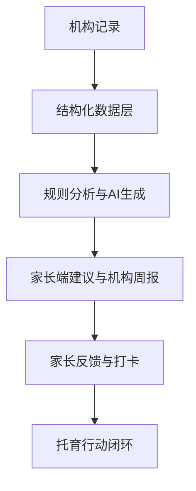

# SmartChildcare v3.0

面向托育机构与家长的 AI 智能托育业务闭环平台。

SmartChildcare 不是一个单纯的数据展示 Demo，而是围绕托育业务真实流程构建的原型系统：

机构记录 -> 系统分析 -> AI 建议 -> 家长反馈 -> 托育行动闭环

当前版本已经完成从机构侧业务录入、家长侧协同反馈，到 AI 建议、AI 周报、事件通知和登录会话保护的一整套闭环能力。

## 在线地址

- 项目网站: https://www.smartchildcare.cn
- GitHub 仓库: https://github.com/VictorMaxWang/childcare-smart

## 项目定位

本项目服务于普惠性托育场景，目标是解决以下问题：

- 幼儿健康、饮食、成长观察数据分散，难以持续跟踪
- 家长与机构沟通依赖碎片化消息，闭环弱
- 机构很难从日常记录中快速提炼出风险、亮点与干预动作
- 托育建议往往依赖经验，缺少结构化、可解释、可追踪的辅助系统

SmartChildcare 通过结构化数据采集、规则分析、AI 生成和家园协同机制，把托育业务做成可记录、可分析、可反馈、可追踪的数字化流程。

## 当前版本亮点

### 1. 机构侧业务闭环已打通

- 儿童档案管理
- 晨检与健康管理
- 饮食记录与批量录入
- 成长与行为观察
- 家长反馈与协同任务
- 首页总览与机构监控大屏

### 2. AI 能力已从“建议生成”升级到“持续辅助决策”

- 家长端 AI 个性化建议
- AI 详细方案输出
- AI 继续追问能力
- AI 周报生成
- AI 不可用时规则兜底

### 3. 平台能力已升级为真实系统原型

- 登录 / 登出 / 会话校验
- Cookie 会话机制
- 路由访问保护
- 本地状态 + 远端状态同步
- 管理员通知事件接口
- 远端发布校验脚本

## 功能模块

### 首页总览看板

系统首页聚合展示机构日常运营和业务链路状态，包括：

- 今日出勤
- 晨检异常提醒
- 未完成晨检提示
- 一周趋势数据
- 管理动作快捷入口
- AI 周报结果
- 规则建议与机构级风险对比

适合用于演示“机构如何从每日记录进入分析与决策”。

### 儿童档案管理

支持机构维护幼儿基础档案，并与业务状态联动：

- 按姓名、昵称、监护人、班级、年龄段、出勤状态搜索
- 基于出生日期自动计算年龄与年龄段
- 支持新增、删除幼儿档案
- 与今日出勤、后续业务统计直接联动

### 晨检与健康管理

支持记录和追踪幼儿健康状态：

- 体温
- 情绪状态
- 手口眼检查
- 健康备注
- 异常状态标记

同时提供：

- 全部 / 异常 / 待检查筛选
- 近 7 日健康趋势图
- 机构与班级视角统计

### 饮食记录与批量录入

饮食模块已从单条录入升级为更贴近机构场景的批量流程：

- 批量餐食录入
- 过敏拦截
- 例外排除
- 单个幼儿精细调整
- 饮水量记录
- 偏好 / 拒食状态记录
- 营养评分与周趋势分析

### 成长与行为观察

支持教师与机构对幼儿成长行为做结构化记录：

- 成长 / 行为观察记录
- 不同年龄段观察指标匹配
- 需要关注标记
- 跟进行动
- 复查日期与复查状态
- 历史时间线

### 家长端与家园共育

家长端不再只是“查看页面”，已经支持协同反馈与任务闭环：

- 查看当日饮食
- 查看成长观察记录
- 查看本周变化趋势
- 查看 AI 系统建议
- 提交家长反馈
- 每周任务与每日打卡
- 家园反馈时间线

### AI 建议与 AI 追问

当前版本已正式接入 AI 建议能力，并支持多轮交互：

- 根据近 7 天健康、饮食、成长、反馈数据生成建议
- 输出 AI 总结、亮点、关注点、行动方案
- 支持“今天园内 / 今晚家庭 / 48 小时内复查”三段式方案
- 支持围绕某条建议继续追问
- 支持最近 3 轮上下文保留
- AI 不可用时自动规则兜底

### AI 周报

3.0 版本新增机构级 AI 周报能力：

- 汇总机构近一周运营与健康数据
- 自动生成亮点、风险和下周动作建议
- 提供模型信息、趋势预测和缓存刷新机制
- AI 不可用时自动降级到规则周报

### 机构监控大屏

当前版本还提供了面向教师 / 管理员的监控视角：

- 今日出勤率
- 晨检异常人数
- 家长反馈数量
- 近七日均温趋势
- AI 干预前后效果对比
- IoT 模拟状态展示

### 通知事件管理

管理员侧已具备通知事件处理接口：

- 拉取通知事件
- 为未打卡任务手动入队
- 批量处理待办事件

这使平台具备了向“自动提醒 / 自动运营动作”延展的后端基础。

## 技术栈

### 前端

- Next.js 16
- React 19
- TypeScript
- Tailwind CSS v4
- Recharts
- Radix UI

### 状态与数据

- React Context + 统一 Store
- localStorage 本地持久化
- Supabase 远端快照同步

### AI 能力

- DashScope / Bailian
- Qwen 模型
- 规则兜底策略

### 部署

- Vercel
- 自定义域名发布

## 系统架构图



## 项目结构

```text
childcare-smart/
├─ app/
│  ├─ api/
│  │  ├─ admin/notification-events/
│  │  ├─ ai/follow-up/
│  │  ├─ ai/suggestions/
│  │  ├─ ai/weekly-report/
│  │  ├─ auth/
│  │  └─ state/
│  ├─ children/
│  ├─ diet/
│  ├─ growth/
│  ├─ health/
│  ├─ login/
│  ├─ parent/
│  ├─ teacher/
│  └─ page.tsx
├─ components/
├─ lib/
│  ├─ ai/
│  ├─ auth/
│  ├─ persistence/
│  ├─ supabase/
│  └─ store.tsx
├─ scripts/
├─ public/
└─ README.md
```

## 快速开始

### 1. 安装依赖

```bash
git clone https://github.com/VictorMaxWang/childcare-smart.git
cd childcare-smart
npm install
```

### 2. 配置环境变量

复制 `.env.example` 并填写需要的环境变量：

```bash
cp .env.example .env.local
```

至少建议配置：

```env
AUTH_SESSION_SECRET=your-local-session-secret
AUTH_DEFAULT_PASSWORD=123456
NEXT_PUBLIC_FORCE_MOCK_MODE=false
```

如果你要启用 AI：

```env
DASHSCOPE_API_KEY=your-api-key
BAILIAN_MODEL=qwen-plus
BAILIAN_ENDPOINT=https://dashscope.aliyuncs.com/compatible-mode/v1/chat/completions
```

如果你要启用远端数据同步：

```env
NEXT_PUBLIC_SUPABASE_URL=your-supabase-url
NEXT_PUBLIC_SUPABASE_ANON_KEY=your-anon-key
SUPABASE_SERVICE_ROLE_KEY=your-service-role-key
```

### 3. 启动开发环境

```bash
npm run dev
```

默认访问：

```text
http://localhost:3000
```

## 本地演示账号

本地开发环境默认支持以下账号：

- `u-admin` / 陈园长 / 机构管理员
- `u-teacher` / 李老师 / 教师
- `u-teacher2` / 周老师 / 教师
- `u-parent` / 林妈妈 / 家长

如果未单独配置用户密码，本地默认密码为：

```text
123456
```

## 可用脚本

### 基础脚本

```bash
npm run dev
npm run build
npm run start
npm run lint
```

### AI 与发布校验脚本

```bash
npm run ai:smoke
npm run release:check
npm run release:gate:local
npm run release:gate:remote
npm run release:go:all
```

适合在本地答辩演示、远端发布前检查和 CI 环境中使用。

## 当前版本相对早期版本的升级

### 相比 1.0

- AI 建议从占位演示升级为正式接入
- 家长端从单向查看升级为可反馈、可打卡、可协同
- 数据从前端演示状态升级为本地持久化 + 远端同步
- 业务从基础记录升级为真正的闭环流程

### 相比 2.0

- 新增 AI 多轮追问
- 新增机构级 AI 周报
- 新增导出长图能力
- 新增机构监控大屏
- 新增通知事件接口
- 新增更严格的登录与会话保护
- 新增更完整的结构化观察与批量业务能力

## 适用场景

该项目适合用于：

- 托育 / 学前教育方向课程设计与毕业设计
- AI + 教育 / AI + 托育方向产品原型展示
- 普惠托育数字化研究项目演示
- 家园协同闭环产品验证
- 前后端一体化业务原型开发参考

## 后续规划

未来版本可以继续扩展：

- 多机构与多租户支持
- 小程序端接入
- 更完整的消息通知链路
- 更长期的成长趋势预测
- 更精细的角色权限系统
- 真实 IoT 数据接入

## License

MIT License

## Star

## Star

如果这个项目对你有帮助，请给一个 Star ⭐
