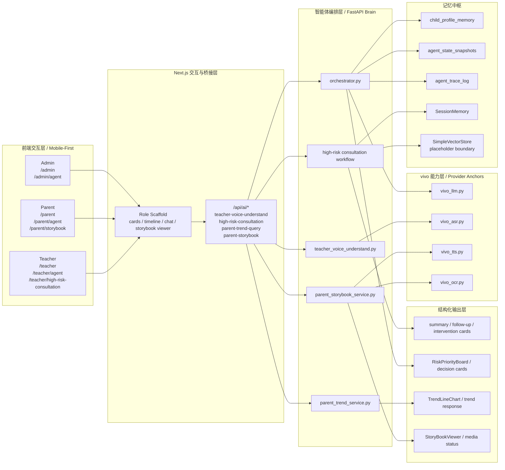
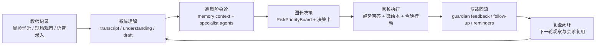
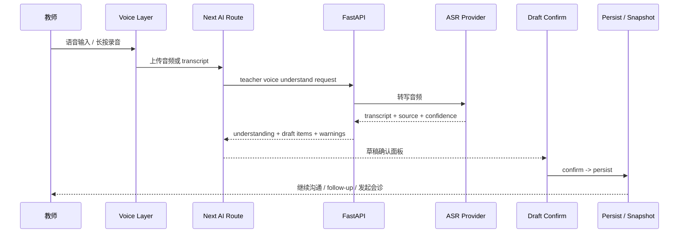
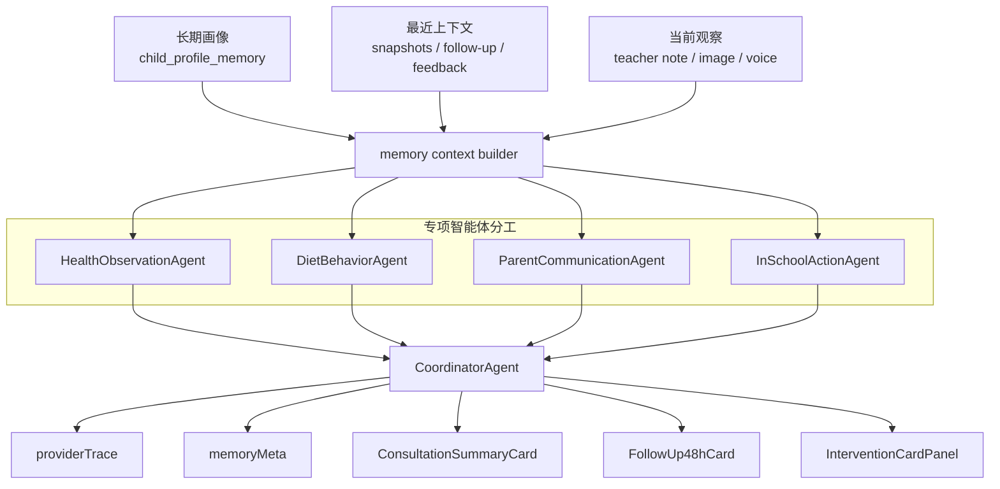
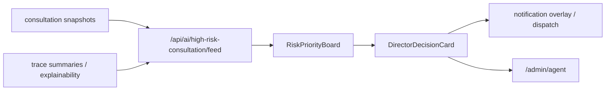
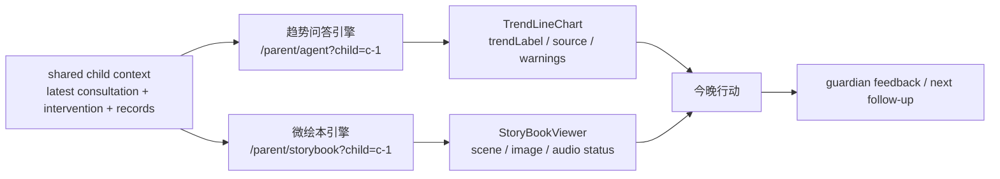
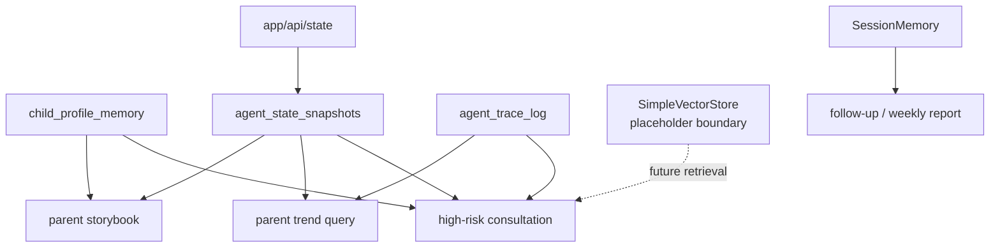

# SmartChildcare Agent

> SmartChildcare Agent 不是一个托育后台，而是一套面向教师、家长与园长协同决策的移动端智能体系统。  
> 它的核心价值不在于回答一个问题，而在于把托育记录、连续观察、结构化会诊、家庭执行与复查回流收束成真正可执行的闭环。

这不是把托育后台接上一个聊天框，而是围绕教师、家长、园长三端，用 Multi-Agent 工作流、记忆中枢、结构化输出和移动端优先交互，把园内观察、风险识别、机构决策、家庭执行与复查反馈组织成一条可演示、可答辩、可继续演进的智能决策链路。项目叙事与能力映射优先对齐 vivo AIGC 创新赛。

**关键词**

- 完整智能体系统，不是托育后台外接单点 AI 能力
- 多角色协同，不是单轮问答
- 记忆中枢驱动，不是一次性生成
- 移动端优先，适合录屏、答辩、路演

## 项目定位

SmartChildcare Agent 面向教师、家长、园长三个核心角色，组织了一套移动端优先的托育 AI 智能体应用。教师端负责低成本记录与快速理解，园长端负责高风险优先级与机构级承接，家长端负责理解、执行、反馈与情感连接；中间由 FastAPI orchestrator、记忆中枢和结构化 Agent 输出把各端串成闭环。

它要解决的不是“多一个 AI 功能”，而是“让托育现场的关键决策链路真正跑起来”。这也是它与普通信息化系统、普通聊天机器人、普通比赛演示页之间的本质差异。

## 为什么这个项目重要

托育场景最难的不是记录本身，而是连续闭环。

教师没有时间整理碎片观察，园长需要知道今天最该盯谁，家长需要知道今晚到底做什么，以及做完之后如何把反馈带回下一轮判断。这意味着托育不是单轮问答，而是一条持续工作的智能决策链路：

**记录 → 理解 → 决策 → 干预 → 反馈 → 复查**

这正是智能体系统的价值所在。系统不是停在“给一句建议”，而是把结构化记录、会诊分工、决策承接、家庭执行与复查回流收束成面向真实业务闭环的 AI 助手系统。

## 系统总架构



这套架构直接说明了一件事：系统的核心不是“托育后台外接单点 AI 能力”，而是“多角色前端入口 + 智能体编排层 + 记忆中枢 + 结构化输出层”。评委不需要先看代码，也能通过这张图理解它为什么是完整系统，而不是单点能力拼接。

## 三大评委主线

### 1. Teacher 语音智能体主线

- 用户是谁：教师
- AI 在做什么：把现场观察通过语音入口压缩成 transcript、understanding 与可确认草稿
- 为什么体现智能体价值：系统先捕捉、再理解、再推动执行，而不是让教师先写完一整份记录
- 为什么适合录屏答辩：移动端入口明确，单屏任务清晰，能够快速形成“输入到执行”的主路径

### 2. 高风险会诊 + Admin 决策主线

- 用户是谁：教师与园长
- AI 在做什么：把高风险儿童的长期画像、最近上下文与当前观察汇入 Multi-Agent 会诊，再把结论压缩成园长当天最该处理的决策卡
- 为什么体现智能体价值：系统不是只给一句建议，而是完成会诊分工、优先级排序与 explainability 承接
- 为什么适合录屏答辩：stage 推进、会诊卡片、RiskPriorityBoard、决策承接全部可视化，系统感最强

### 3. Parent 趋势问答 + 微绘本主线

- 用户是谁：家长
- AI 在做什么：一条引擎负责趋势解释与行动建议，一条引擎负责把成长亮点和今晚任务组织成微绘本
- 为什么体现智能体价值：系统同时处理理性解释与情感连接，不只做效率工具
- 为什么适合录屏答辩：既有结构化趋势图，也有具象化微绘本，易形成记忆点

## 多角色闭环流程



这条闭环决定了它不是普通问答产品。教师输入不是终点，家长反馈也不是终点；系统通过持续回流的上下文，把每一次观察都变成下一轮判断的起点。

## Teacher 智能体主线

Teacher 主路径从 `/teacher` 的全局语音入口出发，经过 `/api/ai/teacher-voice-understand`、FastAPI `teacher_voice_understand.py`、ASR provider 与草稿确认面板，把一段现场观察压缩成可确认、可持久化、可继续跟进的结构化记录。这是系统从输入到执行的第一条主 Agent 路径。



这一段最能体现移动端优先交互。教师不是先面对复杂表单，而是先把观察捕捉下来，再由系统完成 transcript、understanding、草稿确认与后续动作承接。

## 高风险会诊 Multi-Agent 工作流

`/teacher/high-risk-consultation` 是当前最强的 Multi-Agent 展示位。它不是把一段提示词包成一个结果页，而是把长期画像、最近快照、当前风险信号和会诊分工收束成可解释、可推进、可承接的结构化决策链路。



这条链路的价值在于三点：它显式使用记忆上下文，它显式展示多 Agent 分工，它显式保留 explainability。`providerTrace` 和 `memoryMeta` 不是装饰，而是评委理解“这不是黑箱生成”的关键证据。

## 园长决策区

园长端的重点不是看表格，而是看“今天最该盯谁”。`/admin` 和 `/admin/agent` 承接高风险会诊的结构化结果，用 `RiskPriorityBoard`、决策卡与通知承接把个体会诊上升为机构级决策。



这意味着园长看到的不是“又多了一张报表”，而是“今天最该先处理哪一位儿童、为什么、需要谁来承接、后续如何追踪”。这是机构级智能决策，而不是单页展示。

## 家长双引擎

家长侧不是附属页面，而是系统闭环里真正承担“理解、执行、反馈”的角色。一条引擎负责趋势问答与理性解释，一条引擎负责微绘本与情感连接，两条引擎共同把家庭端带入行动闭环。



趋势问答提供理性价值，让家长知道最近 7 / 14 / 30 天到底发生了什么变化；微绘本提供情感价值，让家长愿意看、看得懂、接得住今晚任务。两者共同构成家长端的双引擎体验。

## 记忆中枢

系统的闭环能力建立在记忆中枢之上，而不是建立在一次性上下文拼接之上。当前仓库中已经存在 `child_profile_memory`、`agent_state_snapshots`、`agent_trace_log`、`SessionMemory` 与 `SimpleVectorStore` 等基础设施；其中 vector 仍应按 placeholder 边界保守表述。



这也是 README 需要明确写成“记忆中枢驱动”的原因。系统的强度不在一个模型回答得多漂亮，而在每一轮记录、会诊、决策、反馈都能被下一轮继续消费。

## 技术亮点 / Agent 亮点

- **Multi-Agent 协同**：高风险会诊不是单 Agent 问答，而是多个专项智能体分工协同后由 Coordinator 收束。
- **Memory / Snapshot / Trace**：系统以 `child_profile_memory`、snapshots、trace 为中枢，而不是只依赖单轮 prompt。
- **SSE 流式会诊**：会诊过程支持 stage 化推进，天然适合答辩时展示“过程”而不只是“结果”。
- **Explainability**：`providerTrace` 与 `memoryMeta` 让输出链路具备可解释性，便于评委理解系统不是黑箱。
- **Mobile-first**：Teacher、Parent、Admin 三端都以移动端任务流和单屏决策感为优先。
- **结构化输出**：summary card、follow-up card、intervention card、RiskPriorityBoard、TrendLineChart、StoryBookViewer 形成统一输出层。
- **Feed + fallback 策略**：系统保留 feed、snapshot、trace 与 fallback 边界，强调真实展示能力，同时不夸大 live 状态。

## vivo 生态与能力接入

所有涉及 vivo 能力接入的描述，都以官方文档为唯一准绳：

- [vivo 官方文档入口](https://aigc.vivo.com.cn/#/document/index?id=1746)

当前 README 仅保守陈述以下事实：

- 仓库中存在 `backend/app/providers/vivo_llm.py`、`backend/app/providers/vivo_asr.py`、`backend/app/providers/vivo_tts.py`、`backend/app/providers/vivo_ocr.py` 等 provider 落点。
- Teacher 语音入口优先映射 ASR，会诊与智能体编排优先映射 LLM，家长媒体链路保留 TTS / OCR / media provider 扩展位。
- `VIVO_APP_ID` / `VIVO_APP_KEY` 只允许通过环境变量接入，不能写入代码、README、日志、截图或示例文件。
- 本 README 不把任何 vivo provider 写成真实上游已全面接通，也不把 staging 写成已完全切到实链路。

## 当前边界与保守口径

- `demo_snapshot`、`next-stream-fallback`、`next-json-fallback` 只属于后段边界说明，不是项目身份定义。
- Teacher 语音主线可以写成“已具展示闭环”，但 ASR 真实上游状态仍保持保守表述。
- 高风险会诊可以写成“当前最强 Multi-Agent 展示位”，但不扩写成完整远端链路已经全部验收。
- Admin 决策区可以写成“机构级决策承接位”，但不扩写成远端聚合已经全部打通。
- Parent 趋势问答与微绘本可以写成“已具展示能力”，但不把图像、配音和上游 provider 写成真实上游已全面接通。

## 演示入口 / 评委观摩路径

推荐按下面的顺序观摩系统：

1. `/teacher`  
   看教师首页、异常儿童、待复查项与全局语音入口，理解系统如何从第一手观察开始。
2. `/teacher/high-risk-consultation`  
   看当前最强的 Multi-Agent 会诊工作流、stage 推进、summary / follow-up / intervention cards，以及 explainability。
3. `/admin`  
   看园长如何从会诊结果中识别“今天最该盯谁”，并把结果承接为机构级决策。
4. `/parent/agent?child=c-1`  
   看趋势问答、TrendLineChart、行动建议与反馈回流，理解家长端的理性价值。
5. `/parent/storybook?child=c-1`  
   看微绘本、scene 状态、image/audio 状态与情感连接，理解家长端的体验价值。

如需先看家长首页的桥接入口，可额外访问 `/parent`。

## 本地运行

### 前端

```powershell
npm install
npm run dev
```

默认地址：`http://127.0.0.1:3000`

### 后端

```powershell
py -m uvicorn app.main:app --app-dir backend --host 127.0.0.1 --port 8000
```

建议在同一终端会话里设置：

```powershell
$env:BRAIN_API_BASE_URL = "http://127.0.0.1:8000"
```

## 最小验证

```powershell
npm run lint
npm run build
$env:PYTHONPATH = "backend"
py -m pytest backend/tests/test_teacher_voice_understand.py backend/tests/test_high_risk_consultation_stream.py backend/tests/test_admin_consultation_feed.py backend/tests/test_parent_trend_service.py backend/tests/test_parent_storybook_service.py backend/tests/test_parent_storybook_endpoint.py backend/tests/test_story_image_provider.py backend/tests/test_vivo_tts_provider.py -q
```

最新功能状态、fallback 边界与阶段口径，以 `docs/current-status-ledger.md` 为准。

## 延伸文档

- [AGENTS.md](./AGENTS.md)
- [docs/current-status-ledger.md](./docs/current-status-ledger.md)
- [docs/competition-architecture.md](./docs/competition-architecture.md)
- [docs/agent-workflows.md](./docs/agent-workflows.md)
- [docs/demo-script.md](./docs/demo-script.md)
- [docs/competition-pitch.md](./docs/competition-pitch.md)
- [docs/freeze-checklists.md](./docs/freeze-checklists.md)
- [docs/teacher-voice-smoke.md](./docs/teacher-voice-smoke.md)
- [docs/teacher-consultation-qa.md](./docs/teacher-consultation-qa.md)
- [docs/parent-trend-smoke.md](./docs/parent-trend-smoke.md)
