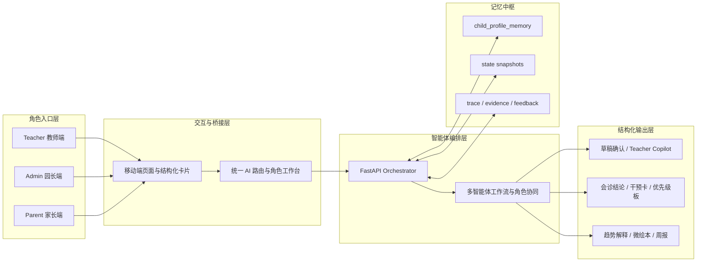
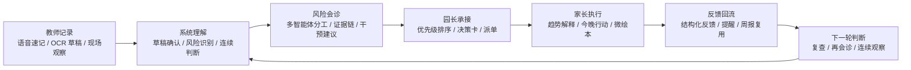
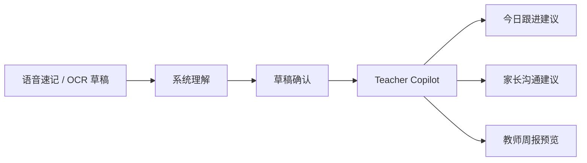
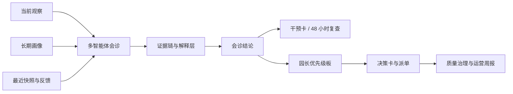
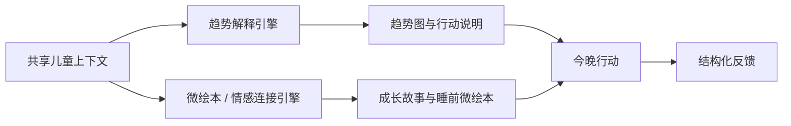
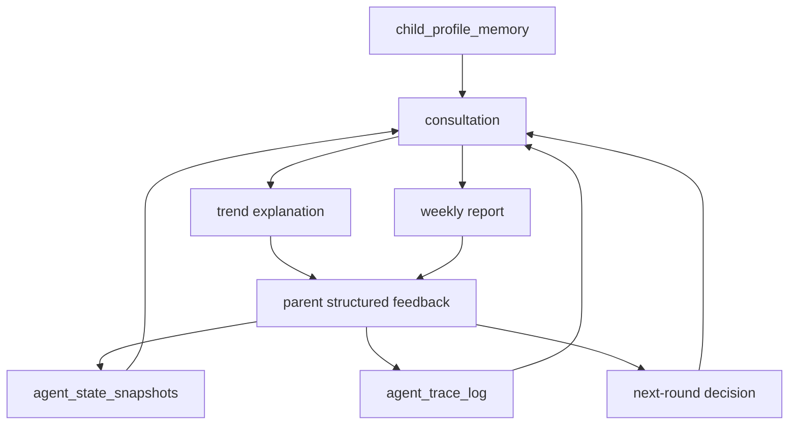

# SmartChildcare Agent

> 面向托育场景的多角色、多智能体、移动端优先协同决策系统。  
> 让教师记录、风险会诊、园长承接、家长执行与反馈回流，形成持续工作的智能闭环，而不是一次性的 AI 回答。

## 项目价值与现实问题

托育现场最难的不是“有没有记录”，而是**记录之后能否真正进入连续判断与行动闭环**。

- 教师记录碎片化，现场观察常常来不及沉淀为结构化信息。
- 家园协同容易停留在单次通知，缺少围绕同一问题的连续跟进。
- 风险判断与机构承接之间经常断层，重要个体难以快速升级到园长视角。
- 家长执行之后，反馈往往无法稳定写回系统，导致下一轮判断仍然“从头开始”。
- 传统信息化系统强调台账，普通聊天式 AI 强调回答，但都不足以支撑托育场景所需的持续闭环。

SmartChildcare Agent 试图解决的，正是这条链路：

**教师记录 -> 系统理解 -> 风险会诊 -> 园长承接 -> 家长执行 -> 反馈回流 -> 下一轮判断**

## 项目整体定位

SmartChildcare Agent 不是托育后台外挂一个聊天框，也不是单点式 AI 功能集合，而是一套围绕教师、园长、家长三类角色共同运行的协同决策系统。

它的核心定位包括：

- `Multi-Agent`：把理解、会诊、建议、承接拆成有分工的智能体链路，而不是单轮问答。
- `Mobile-first`：优先服务竖屏、单屏、短链路的真实使用与演示场景。
- `Memory-driven`：以儿童画像、状态快照、会诊轨迹和反馈回流作为连续判断底座。
- `Structured decision-making`：输出草稿、风险证据、干预卡、优先级卡、周报，而不是只输出一段文本。
- `Closed-loop collaboration`：让教师、园长、家长围绕同一儿童与同一问题形成协同闭环。

## 系统总架构



这套架构表达的重点不是某一个模型、某一个页面或某一条接口，而是一个完整系统如何运转：  
角色入口负责采集与使用，编排层负责理解与决策，记忆中枢负责连续性，结构化输出负责承接行动。

## 多角色闭环



项目的系统价值，就体现在这条闭环上。  
教师输入不是终点，家长反馈也不是终点；每一轮记录和执行，都会成为下一轮判断的输入。

## 三条主展示主链

### 1. Teacher 智能体主链

教师侧的目标不是增加填表负担，而是把“现场观察”尽快压缩为可确认、可跟进、可协作的结构化输入。

- 支持语音速记与 OCR 草稿，降低现场记录门槛。
- 系统先完成理解与草稿化，再由教师确认，而不是要求教师先写完完整记录。
- Teacher Copilot 会补充记录完善提示、30 秒 SOP 和家长沟通话术。
- 同一工作区继续承接今日跟进行动、家长沟通建议与班级周报预览。



这一主链体现的是“先捕捉，再理解，再执行”的设计逻辑，适合移动端使用，也适合评审快速理解其产品成熟度。

### 2. 高风险会诊与园长决策主链

高风险会诊不是把一段提示词包装成结果页，而是把**当前观察、历史画像、最近上下文与多智能体分工**收束成可承接的结构化决策链。

- 会诊过程支持阶段式流转，便于展示“如何得出结论”，而不只是展示最终结果。
- 证据链界面把来源、置信度、人工复核需求和支撑关系显式可见。
- 会诊结果会沉淀为园内动作、今晚家庭任务与 48 小时复查点。
- 园长端进一步承接为风险优先级、决策卡、派单动作与治理视角。
- Admin 首页同时提供机构级质量治理区与运营周报预览，形成“当日优先级 + 机构治理”双视角。



这条主链体现的是机构级的判断闭环：不仅知道“谁需要关注”，还知道“为什么、谁来承接、后续如何追踪”。

### 3. Parent 双引擎主链

家长侧不是附属页面，而是系统闭环中真正承担“理解、执行、反馈”的角色。

- 一条链负责趋势解释，把近 7/14/30 天变化转成可理解、可行动的说明。
- 一条链负责情感连接，把成长亮点、今晚任务和会诊上下文组织成微绘本。
- 关怀模式为祖辈或低数字熟练度照护者提供更短链路、更大字、更少决策负担的首屏体验。
- 结构化反馈把执行结果重新写回系统，进入下一轮趋势判断、会诊和周报。
- 家庭周报预览让家长看到“本周发生了什么”与“接下来应该做什么”。



Parent 双引擎的意义在于：系统同时处理理性解释与情感连接，让家长既愿意看，也看得懂、做得下去。

## 记忆中枢与决策中枢

SmartChildcare Agent 的关键差异，在于它不是一次性问答，而是一个持续消费上下文的系统。

- `child_profile_memory` 沉淀儿童长期画像。
- `agent_state_snapshots` 保留各轮理解、会诊、跟进与周报结果。
- `agent_trace_log` 与证据链让系统保留过程信息，而不是只有答案。
- 家长结构化反馈会回流到趋势解释、会诊判断、周报摘要与后续提醒。
- 年龄分层照护策略已经开始接入 Teacher、Parent 与干预建议主链，使建议不再是泛儿童化表达。



换句话说，系统真正积累的不是“回答”，而是**判断上下文**。  
这也是它更接近智能体系统，而不是单次内容生成工具的原因。

## 结构化输出与可解释性

项目的输出设计强调可承接、可追踪、可解释，而不是只追求生成效果。

- 教师侧输出：草稿确认卡、补全提示、微培训 SOP、家长沟通话术。
- 会诊侧输出：总结卡、Follow-up 卡、Intervention Card、风险等级与证据链。
- 园长侧输出：Risk Priority Board、决策卡、派单入口、质量治理指标、运营周报预览。
- 家长侧输出：趋势解释卡、趋势图、今晚行动、微绘本、结构化反馈表单、家庭周报预览。
- 解释层输出：`source`、`dataQuality`、`warnings`、`memoryMeta` 等元信息，用于说明判断依据与运行边界。

这些结构化结果的意义在于，它们都不是展示终点，而是下一步动作的入口。

## 高层技术实现

项目采用前后端分层、工作流编排和状态回流结合的方式实现：

- 前端：`Next.js` 承载教师、园长、家长三类角色入口与移动端优先交互。
- 后端：`FastAPI` 负责统一编排 Teacher、会诊、Parent、周报、治理等核心工作流。
- 状态与记忆：围绕儿童画像、快照、轨迹和反馈形成持续可复用的判断底座。
- 智能能力接入：兼容国产通用大模型能力接入，支持 `Qwen / DeepSeek` 等模型能力用于结构化推理、多模态理解与内容生成。
- 输出策略：优先以结构化卡片、图表、周报和证据链呈现，而不是把复杂流程压成一段长文本。

## 推荐体验路径

建议按以下顺序体验系统主链：

1. `/teacher`  
   从教师视角进入记录与工作台，理解系统如何从第一手观察开始。
2. `/teacher/high-risk-consultation`  
   观看高风险会诊的阶段流、证据链和干预卡，这是系统最强的智能体展示位。
3. `/admin`  
   观察园长如何承接会诊结果，完成优先级判断、治理查看与决策推进。
4. `/parent`  
   查看家长首页如何把今晚任务、趋势入口、关怀模式与反馈入口组织成短链路体验。
5. `/parent/storybook?child=c-1`  
   体验微绘本如何把成长亮点与任务建议转成更具情感连接的表达。
6. `/parent/agent?child=c-1`  
   查看趋势解释、继续追问、结构化反馈与下一轮闭环如何合并在同一工作区。

## 项目亮点总结

- 它把教师、园长、家长三类角色组织进同一条智能闭环，而不是分别做三个独立页面。
- 它把会诊、干预、优先级、周报、反馈都做成结构化输出，让系统天然具备承接动作的能力。
- 它以记忆中枢驱动连续判断，让每次记录、会诊和反馈都能进入下一轮决策。
- 它在理性解释之外，加入微绘本与关怀模式，让家长侧同时具备行动价值与情感连接。
- 它保留证据链、来源说明和数据质量提示，使系统更容易被理解、被审阅、被信任。

## 轻量说明

- 本 README 仅陈述当前已经形成稳定主链的系统能力，不把扩展能力写成既成事实。
- 外部健康资料桥接、自动升级规则、完整透明层与全量媒体实时生成，仍按扩展能力保守表达。
- 家长趋势、周报与会诊链路保留来源与质量说明，用于支持解释与审阅，而不是弱化系统能力。
- 故事图像、配音、语音理解等能力不写成唯一生产事实，也不写成已完成全链路远端验收。

<details>
<summary>本地启动</summary>

### 前端

```powershell
npm install
npm run dev
```

### 后端

```powershell
py -m uvicorn app.main:app --app-dir backend --host 127.0.0.1 --port 8000
```

</details>

## 补充文档

- [当前状态账本](./docs/current-status-ledger.md)
- [工作流地图](./docs/agent-workflows.md)
- [演示脚本](./docs/demo-script.md)
- [协作手册](./AGENTS.md)
