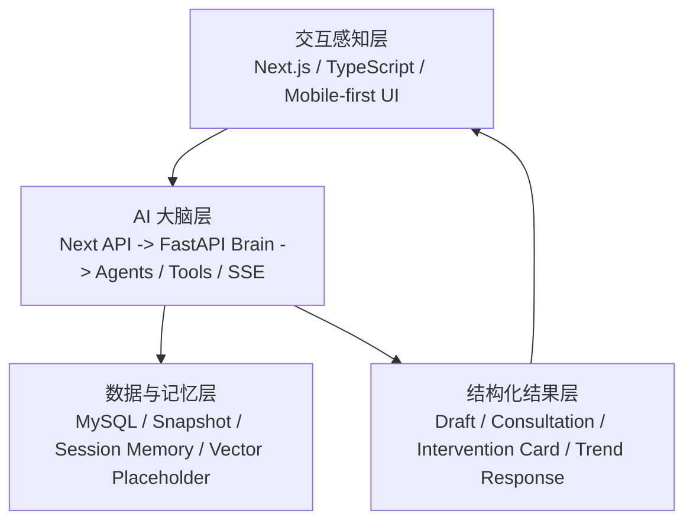

# SmartChildcare Agent

面向托育场景的移动端优先 AI 助手 / Multi-Agent 比赛原型。

SmartChildcare Agent 不是普通托育后台，也不只是一个“加了 AI 的管理系统”。它围绕教师、家长、园长/管理员和机构的真实协同流程设计，试图把托育现场里最耗时、最碎片、最难形成闭环的环节，压缩成一个适合移动端使用、可录屏演示、可持续接力开发的 Agent 系统。

核心闭环是：

`机构记录 -> 系统分析 -> AI 建议 / Agent 工作流 -> 家长反馈 -> 托育行动闭环`

当前项目优先服务 vivo 赞助的 AIGC 创新赛，因此 README 同时面向三类读者：

- 比赛评委：快速看懂项目价值、主路径和可答辩点
- 老师/队友：快速理解角色场景、当前能演示什么、如何协作
- 开发者：快速找到仓库结构、启动方式、环境变量和延伸文档

## 一、项目简介

SmartChildcare Agent 的目标不是把托育场景再做成一个更复杂的后台，而是把托育一线真正高频的判断和沟通工作，变成一个移动端优先的 AI 助手系统。

它当前已经具备三条真实角色主线：

- 教师端：围绕异常儿童、晨检、观察记录、语音速记、家长沟通和高风险会诊
- 家长端：围绕今日状态、今晚任务、反馈提交、趋势追问和干预卡
- 园长端：围绕机构优先级、风险儿童、问题班级、派单和周报

从仓库现状看，这个项目更接近一个“多角色协作的托育 Agent 产品原型”，而不是单纯的信息化系统。

## 二、为什么这个项目有意义

托育场景里最难的不是“有没有记录”，而是“记录之后能不能快速转成行动”。

这个项目聚焦三个真实痛点：

- 老师记录成本高  
  现场观察、晨检异常、情绪变化、饮食问题通常发生在碎片化时间里。老师知道该记录，但不一定有时间在当下写成完整结构。
- 家园沟通碎片化  
  家长往往只收到零散结论，不清楚今晚具体该做什么、做完如何反馈、明天老师会继续看什么。
- 园长缺少可执行优先级  
  园长并不缺数据总览，真正缺的是“今天先处理哪三个问题、谁来跟、什么时候复查”的可执行顺序。

SmartChildcare Agent 的价值，不在于把数据堆得更全，而在于把“发现问题、生成建议、组织动作、收集反馈、继续复查”做成连续工作流。

## 三、核心角色与核心能力

### Teacher

典型场景：

- 早晚高峰快速记录儿童异常
- 把碎片化观察转成结构化草稿
- 一键发起高风险儿童会诊
- 生成家长沟通建议和今日跟进行动

当前已实现 / 在建能力：

- 教师首页 `/teacher`：聚焦异常儿童、未完成晨检、待复查和待沟通家长
- 教师 AI 助手 `/teacher/agent`：支持工作流式生成沟通建议、跟进行动和周总结
- 语音速记与草稿确认：教师端全局语音入口、上传/理解接口、草稿确认面板均已落地
- 高风险儿童一键会诊 `/teacher/high-risk-consultation`：支持流式阶段展示、结构化结果卡和后续同步

AI 在其中扮演的角色：

- 帮老师把“先记录再整理”变成“先捕捉再确认”
- 帮老师把单条观察转成后续沟通、复查和会诊动作
- 帮老师把高风险问题升级为多 Agent 协作而不是单点回复

### Parent

典型场景：

- 查看孩子今天的关键状态
- 理解今晚最值得执行的一件家庭任务
- 做完任务后提交反馈，继续追问
- 用趋势问答看 7 / 14 / 30 天变化

当前已实现 / 在建能力：

- 家长首页 `/parent`：聚焦今日情况、AI 提醒、今晚任务、待反馈事项和趋势入口
- 家长 AI 助手 `/parent/agent`：支持建议、追问、趋势快问、反馈提交和干预卡查看
- 家长趋势问答：已有后端聚合与前端图表/回复卡基础
- 家长话术优化：已有后端 reflexion / evaluator 基础，但仍以可演示原型口径表述

AI 在其中扮演的角色：

- 帮家长理解“今晚先做什么、为什么现在做”
- 帮家长把执行反馈带回老师和下一轮 Agent 上下文
- 帮家长把趋势图、解释文本和建议整合成可追问的对话流

### Director / Admin

典型场景：

- 识别机构今天最该优先处理的问题
- 从高风险儿童会诊结果中抽取决策卡
- 生成派单和周报，组织机构协同

当前已实现 / 在建能力：

- 园长首页 `/admin`：聚焦机构优先级、风险儿童、问题班级、待处理派单
- 园长 AI 助手 `/admin/agent`：支持今日优先事项、周报和 follow-up 提问
- Admin 决策区 / 风险优先级 / 会诊 trace：已形成第二展示位
- 通知事件与派单：有真实路由和前端操作入口，适合演示闭环，不宜夸大为完整生产派单系统

AI 在其中扮演的角色：

- 帮园长从“看报表”转到“先处理谁、怎么派、何时复查”
- 把教师端会诊结果压缩成机构级动作建议
- 把日常风险看板变成可解释、可追踪的优先级工作流

## 四、三条最重要的主演示路径

### 1. 教师端：语音/文本观察记录 -> 智能理解 -> 草稿确认 -> 后续流转

当前状态：`已具备可演示主线`

真实落点：

- 全局语音入口：`app/teacher/layout.tsx`
- 教师语音层：`components/teacher/TeacherVoiceAssistantLayer.tsx`
- 上传 / 理解接口：`app/api/ai/teacher-voice-upload/route.ts`、`app/api/ai/teacher-voice-understand/route.ts`
- 草稿确认：`components/teacher/TeacherDraftConfirmationPanel.tsx`

建议讲法：

- 老师不需要先写完整记录，而是先说出来 / 先拍下来
- 系统把输入转成结构化草稿，再让老师确认
- 草稿确认后，继续流向教师 Agent 或高风险会诊

### 2. 高风险儿童：一键会诊 -> 多 Agent 汇总 -> 风险解释 -> 教师/家长/园长动作卡

当前状态：`当前最强展示位`

真实落点：

- 页面：`/teacher/high-risk-consultation`
- 流式 route：`app/api/ai/high-risk-consultation/stream/route.ts`
- 多 Agent 逻辑：`lib/agent/high-risk-consultation.ts`、`lib/agent/consultation/*`
- 调试 / QA：`components/consultation/*`、`docs/teacher-consultation-qa.md`

建议讲法：

- 系统自动带入长期画像、最近上下文和当前风险信号
- 多 Agent 不只是“分析”，还会产出教师动作、家长今晚任务和园长决策卡
- 页面使用结构化卡片渲染和 SSE 分阶段展示，适合录屏和答辩

### 3. 家长端：今晚任务 -> 反馈 -> follow-up / 趋势问答

当前状态：`已具备可演示闭环，仍在继续打磨`

真实落点：

- 家长首页：`/parent`
- 家长 Agent：`/parent/agent`
- 趋势图与回复卡：`components/parent/TrendLineChart.tsx`、`components/parent/ParentTrendResponseCard.tsx`
- 趋势问答 route：`app/api/ai/parent-trend-query/route.ts`

建议讲法：

- 家长先看到今晚最该做的一件事
- 做完后直接提交反馈，进入下一轮 follow-up
- 如果想追问“最近是不是在变好 / 变差”，可以直接进入趋势问答

## 五、系统架构总览

当前仓库更适合按三层来理解：



### 前端

- Next.js App Router + TypeScript
- 移动端优先界面
- 教师、家长、园长三端分角色页面
- Next `/api/ai/*` 作为统一桥接层

### 后端

- FastAPI 作为 AI brain
- 负责 Agent 编排、provider 调用、memory 接口、SSE 输出
- 当前已覆盖教师、家长、园长、高风险会诊、多模态与部分 ReAct/trace 能力

### 记忆层

- 当前已有 MySQL / SQLite fallback / snapshot / trace / child profile memory 等基础
- session memory 和 vector store 仍属于轻量实现或占位路径
- 更准确的口径是“记忆中枢基础已具备，并已接入部分主工作流”

### 交互层

- 当前已有结构化卡片渲染与 SSE 原型
- 更准确的描述是“结构化结果 + 流式展示基础设施”，而不是完整生成式 UI 平台

## 六、当前项目状态 / 能力矩阵

| 能力 | 当前状态 | 说明 |
| --- | --- | --- |
| 教师端角色主页与 AI 助手 | 已可演示 | `/teacher` 与 `/teacher/agent` 已是完整角色页，不是静态壳 |
| 教师语音速记与草稿确认 | 已可演示 | 已有全局语音入口、上传/理解、草稿确认和后续流转 |
| 高风险儿童一键会诊 | 已可演示 | 当前最强 Agent 展示位，支持 SSE、结构化卡片和多角色去向 |
| 家长端今晚任务闭环 | 已可演示 | 首页、Agent、反馈提交、干预卡已经串起来 |
| 家长趋势问答 | 已具备展示基础 | 后端聚合、图表和回复卡已存在，仍需继续打磨体验 |
| 园长决策支持与派单 | 已可演示 | `/admin` 与 `/admin/agent` 已能展示优先级、动作建议和通知事件 |
| SSE / 结构化卡片渲染 | 已具备基础 | 已有流式事件和结构化 UI 卡片，但不写成完整 Generative UI 平台 |
| 记忆层（snapshot / trace / child profile memory） | 已具备基础 | 主工作流已开始消费 memory context |
| vivo LLM | 代码层已接入，并有测试 / smoke 基础 | 不能据此写成 fully live；真实验收需看 strict staging smoke |
| vivo ASR | 代码层已接入，并有测试 / smoke 基础 | live upstream 仍需真实密钥与真实样本验证 |
| vivo OCR / TTS / Embedding | 预留接口 / stub / mock | 当前不应写成已真实接入 |
| 腾讯云香港 staging | 正在收口 | 当前主线部署目标是 `api-staging.smartchildcareagent.cn`，仍不能写成 fully healthy / fully switched |
| Render 部署痕迹 | 历史配置仍在仓库 | `render.yaml` 仍存在，但不应被理解为当前主线 staging |

补充说明：

- README 以当前仓库真实状态为准，不直接搬运内部任务号。
- 从现状看，教师语音链路、SSE / 结构化卡片、记忆层基础、工具 / trace 能力都已经有可演示基础。
- 仓库和比赛文档统一使用 `SmartChildcare Agent` 作为项目名；前端部分 UI 仍保留历史中文品牌文案，后续会继续统一。

## 七、仓库结构

```text
childcare-smart/
├─ app/          # Next.js App Router 页面与 Next 侧 API bridge/fallback
├─ backend/      # FastAPI brain、providers、memory、DB 适配、tests、smoke scripts
├─ components/   # 角色页组件、会诊组件、图表、通用 UI
├─ lib/          # agent 逻辑、store、mobile 能力、auth、brain client、view model
├─ docs/         # 比赛架构、状态账本、部署 runbook、QA / smoke 文档
├─ scripts/      # 本地 / release / smoke / VPS 检查脚本
├─ public/       # 静态资源
└─ supabase/     # 辅助 SQL / schema 资产
```

如果你是新加入的开发者，建议优先看：

- `app/teacher/*`、`app/parent/*`、`app/admin/*`
- `backend/app/api/v1/endpoints/*`
- `lib/agent/*`
- `components/consultation/*`

## 八、本地运行与开发说明

### 1. 前端启动

安装依赖：

```powershell
npm install
```

复制根目录环境变量模板：

```powershell
Copy-Item .env.example .env.local
```

然后启动前端：

```powershell
npm run dev
```

默认访问：

```text
http://localhost:3000
```

### 2. 后端启动

安装 Python 依赖：

```powershell
py -m pip install -r backend/requirements.txt
```

复制后端环境变量模板：

```powershell
Copy-Item backend/.env.example backend/.env
```

启动 FastAPI：

```powershell
py -m uvicorn app.main:app --app-dir backend --host 127.0.0.1 --port 8000
```

### 3. 本地最小开发组合

本地最常见的开发方式是：

- 前端：`http://localhost:3000`
- 后端：`http://127.0.0.1:8000`
- 根目录 `.env.local` 中设置 `BRAIN_API_BASE_URL=http://127.0.0.1:8000`

### 4. Docker Compose 的用途

仓库中的 [docker-compose.yml](./docker-compose.yml) 和 [Caddyfile](./Caddyfile) 更接近 `staging / VPS 风格的 backend + Caddy 栈`，不是完整的本地一键起前后端开发栈。

当前 compose 主要包含：

- FastAPI backend
- Caddy 反向代理

它不负责部署 Next.js 前端。按当前仓库和文档口径，前端通常部署在 Vercel 或其他前端宿主，再通过 `BRAIN_API_BASE_URL` 指向后端 brain。

### 5. 示例账号

当前仓库保留了本地 demo 账号：

- `u-admin`：园长 / 管理员
- `u-teacher`：教师
- `u-teacher2`：教师
- `u-parent`：家长

默认密码 `123456` 只应理解为本地 demo / 开发默认值，不应理解为线上环境策略。

### 6. 常用验证命令

```powershell
npm run lint
npm run build
py -m pytest backend/tests
npm run ai:smoke
npm run ai:smoke:trend
```

更保守的说法是：

- 当前仓库有本地校验和 smoke 脚本
- 远端 staging / release 验收仍需结合部署文档单独执行

## 九、环境变量与安全说明

### 根目录 `.env.example`

主要服务前端和本地桥接，常见变量包括：

- `AUTH_SESSION_SECRET`
- `AUTH_DEFAULT_PASSWORD`
- `DATABASE_URL`
- `DATABASE_SSL`
- `NEXT_PUBLIC_FORCE_MOCK_MODE`
- `BRAIN_API_BASE_URL`
- `BRAIN_API_TIMEOUT_MS`
- `RELEASE_BASE_URL`
- `RELEASE_ADMIN_COOKIE`
- `CRON_SECRET`

### 后端 `backend/.env.example`

主要服务 FastAPI brain，常见变量包括：

- `ENVIRONMENT`
- `ALLOW_ORIGINS`
- `ENABLE_MOCK_PROVIDER`
- `BRAIN_PROVIDER`
- `REQUEST_TIMEOUT_SECONDS`
- `BRAIN_MEMORY_BACKEND`
- `BRAIN_MEMORY_SQLITE_PATH`
- `MYSQL_URL`
- `VIVO_APP_ID`
- `VIVO_APP_KEY`
- `VIVO_BASE_URL`
- `VIVO_LLM_MODEL`
- `VIVO_OCR_PATH`
- `VIVO_EMBEDDING_MODEL`

### staging / release

如果是 staging / VPS 风格部署，还需要参考根目录 [`.env.release.example`](./.env.release.example) 和后端 [`backend/.env.release.example`](./backend/.env.release.example)。

### 安全原则

- 真实密钥只允许通过环境变量注入
- 不要在 README、代码、示例文件、日志、截图中出现真实密钥
- 特别是：
  - `VIVO_APP_ID`
  - `VIVO_APP_KEY`
  - `MYSQL_URL`
  - `RELEASE_ADMIN_COOKIE`
  - `CRON_SECRET`
- demo 密码和本地默认值不能直接照搬到远端环境

## 十、比赛导向与 vivo 适配说明

这个项目适合 vivo AIGC 创新赛，不是因为“能力全”，而是因为它已经具备几条适合比赛展示的真实产品路径：

- 移动端优先  
  教师、家长、园长三端的页面组织都已经围绕手机首屏任务流设计。
- AI 助手感明确  
  不是把 AI 塞进单个弹窗，而是让 AI 参与记录、理解、建议、复查和派单。
- 多角色 Agent 工作流清晰  
  教师端发现问题，家长端执行和反馈，园长端拿到优先级和决策建议。
- 端云协同边界清楚  
  前端通过 Next `/api/ai/*` 统一桥接，FastAPI 负责 brain / provider / memory / SSE。
- 有扩展到系统入口 / 快应用 / 智能体分发的想象空间  
  但当前 README 只以已存在的仓库基础设施来描述，不夸大成已落地能力。

### vivo 能力当前应如何表述

所有 vivo 相关能力都应以官方文档为准：

- [vivo AIGC 官方文档入口](https://aigc.vivo.com.cn/#/document/index?id=1746)

当前仓库可公开、保守地描述为：

| 能力 | 当前仓库入口 | 当前口径 |
| --- | --- | --- |
| vivo LLM | `backend/app/providers/vivo_llm.py` | 代码层已接入，并有测试 / smoke 基础；真实远端验收需另看 strict staging smoke |
| vivo ASR | `backend/app/providers/vivo_asr.py` | 代码层已接入，并有测试 / smoke 基础；真实音频与真实上游仍需继续验证 |
| vivo OCR | `backend/app/providers/vivo_ocr.py` | 当前以 stub / mock / 预留接口为主 |
| vivo TTS | `backend/app/providers/vivo_tts.py` | 当前以 stub / mock / 预留接口为主 |
| vivo Embedding | `backend/app/providers/vivo_embedding.py` | 当前以预留接口为主 |

不能写成的表述包括：

- 已 fully live
- 已生产可用
- staging 已 fully switched
- health 已经证明当前请求一定命中 vivo 上游

## 十一、重要文档索引

如果你要继续接手这个仓库，建议按这个顺序阅读：

1. [AGENTS.md](./AGENTS.md)  
   长期协作规则、比赛口径、vivo 接入原则、角色边界
2. [docs/competition-architecture.md](./docs/competition-architecture.md)  
   更完整的比赛叙事、主路径、架构层次和 Agentic 设计
3. [docs/current-status-ledger.md](./docs/current-status-ledger.md)  
   当前状态账本、阶段进度、哪些不要误写成已完成
4. [docs/teacher-consultation-qa.md](./docs/teacher-consultation-qa.md)  
   高风险会诊真实链路 / debug / providerTrace / memoryMeta 的 QA 口径
5. [docs/deployment-vps.md](./docs/deployment-vps.md)  
   腾讯云香港 VPS staging 部署与修复 runbook
6. [docs/vps-smoke.md](./docs/vps-smoke.md)  
   staging strict smoke 与 release proxy 验收标准
7. [docs/parent-trend-smoke.md](./docs/parent-trend-smoke.md)  
   家长趋势问答链路的手动与自动验证口径

## 十二、边界与风险说明

为避免夸大，README 明确保留以下边界：

- 本项目用于托育观察、协同和建议，不等价于医学诊断系统
- 当前很多能力是“可演示原型”或“代码层接入”，不应直接等同于生产可用
- 部分链路在 Next 侧仍保留 fallback；页面跑通不等于远端 brain / vivo 真链路已通过
- staging 当前主线是腾讯云香港 VPS + Caddy + `api-staging.smartchildcareagent.cn`，但仍在收口
- Render 配置仍在仓库中，应视为历史部署痕迹或旧路径，不应视为当前唯一主线
- OCR / TTS / Embedding 仍以预留接口或 stub/mock 为主
- 仓库中局部 UI 仍保留历史品牌文案；README 和比赛文档统一使用 `SmartChildcare Agent`

更准确的外部口径应是：

- 这个仓库已经有若干可演示的主路径
- 它已经具备前后端分层、Agent 工作流、结构化卡片和记忆层基础
- 但仍在从“可演示原型”向“更严格可验收版本”推进

## License

[MIT](./LICENSE)
