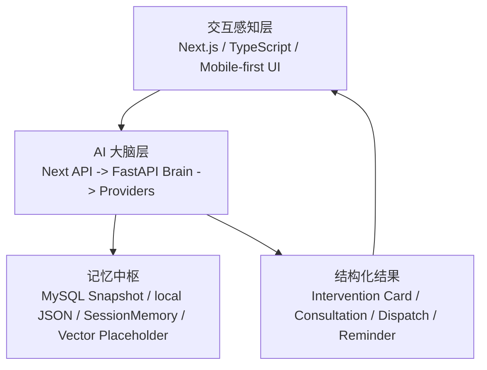

# SmartChildcare Agent 比赛架构总说明

## 1. 项目背景与定位
SmartChildcare Agent 是一个面向托育机构场景的移动端优先 AI 助手 / Agent 系统。它的目标不是做“更复杂的后台”，而是把教师、家长、园长在日常托育工作中最关键的判断、沟通、干预与复盘流程，压缩成适合移动端演示和比赛答辩的产品化路径。

当前仓库的真实代码状态已经具备这个方向的基本骨架：
- 前端使用 Next.js App Router、TypeScript、React 19、Tailwind。
- 角色端已经分为教师、家长、园长三条主线。
- AI 路由已存在于 Next 侧，同时预埋了 FastAPI brain 与 proxy/fallback 机制。
- 高风险儿童一键会诊、多智能体判断、Intervention Card、mobile draft / reminder 等能力已进入仓库主线。

因此，本项目当前最合理的定位是：
- 一个面向 vivo AIGC 创新赛的移动端托育 AI 助手产品原型。
- 一个以 Agent 工作流、跨角色闭环和可演示性为核心的比赛型系统。
- 一个尽量复用现有仓库、按最小可运行增量持续推进的工程基座。

## 2. 为什么它不是普通托育后台，而是移动端托育 AI 助手
普通托育后台强调的是“记录、统计、管理”。SmartChildcare Agent 当前的产品方向更强调“识别、判断、建议、行动、反馈、复盘”。

从当前仓库可见，这种差异已经被写进了页面结构：
- 教师首页 `app/teacher/page.tsx` 不是静态总览，而是围绕异常儿童、未晨检、待复查、待沟通家长组织页面。
- 家长首页 `app/parent/page.tsx` 不是普通信息汇总，而是围绕“今晚该做什么、为什么现在做、做完如何反馈”组织页面。
- 园长首页 `app/admin/page.tsx` 不是常规数据大盘，而是围绕优先级排序、风险儿童、问题班级、待处理派单组织页面。
- 三个 `/agent` 页面都在尝试把结构化上下文转成结构化行动，而不是让用户自己在系统里拼装判断。

因此，项目的核心不是“把托育数据做成数字化”，而是“把托育判断与干预流程做成可由 Agent 驱动的产品主路径”。

## 3. 目标比赛与评审导向
当前最优先服务的比赛目标是 vivo 赞助的 AIGC 创新赛。

比赛导向对实现策略的影响如下：
- 优先做 3 分钟内能讲清楚的主路径，而不是做大而全系统。
- 优先强调移动端产品感，而不是 PC 后台完整性。
- 优先体现 Agent 工作流、跨角色协同、结构化输出和可解释性。
- 优先把 vivo 能力映射到清晰的产品入口，而不是停留在抽象“可接入”层面。
- 优先最大化复用现有仓库，让已有页面、AI routes、bridge、store、backend brain 成为比赛版本的基础设施。

当前比赛阶段的默认取舍：
- 如果一个能力能显著增强 Teacher / Parent / Admin 三端闭环，就优先。
- 如果一个能力只能增强工程纯度、不能增强 demo 叙事，就后置。
- 如果一个能力需要大范围改写现有角色结构，就后置。

## 4. 当前仓库现状扫描总结
### 已有能力
- 角色级首页、角色级 Agent 页面、登录与 session 流程已存在。
- Next 侧 AI routes 已覆盖建议、追问、教师 Agent、园长 Agent、周报、高风险会诊、多模态和 SSE。
- 高风险会诊链路已能生成教师动作、家长任务、园长决策卡、Intervention Card 和 reminder。
- 本地 mobile draft、sync status、reminder、consultation、intervention card 已进入统一 store。
- `/api/state` 已支持机构级 MySQL snapshot 同步。
- backend FastAPI 已具备 agent endpoints、multimodal endpoints、stream endpoint、provider 层、memory 层和 tests。

### 已有角色端
- 教师端
  - `app/teacher/page.tsx`
  - `app/teacher/agent/page.tsx`
  - `app/teacher/high-risk-consultation/page.tsx`
- 家长端
  - `app/parent/page.tsx`
  - `app/parent/agent/page.tsx`
- 园长端
  - `app/admin/page.tsx`
  - `app/admin/agent/page.tsx`

### 已有 AI 路由 / 页面
- Next AI routes
  - `app/api/ai/suggestions/route.ts`
  - `app/api/ai/follow-up/route.ts`
  - `app/api/ai/teacher-agent/route.ts`
  - `app/api/ai/admin-agent/route.ts`
  - `app/api/ai/weekly-report/route.ts`
  - `app/api/ai/high-risk-consultation/route.ts`
  - `app/api/ai/vision-meal/route.ts`
  - `app/api/ai/diet-evaluation/route.ts`
  - `app/api/ai/stream/route.ts`
- 相关后台派单路由
  - `app/api/admin/notification-events/route.ts`

### 已有可复用模块
- UI / 页面骨架
  - `components/role-shell/RoleScaffold.tsx`
  - `components/agent/InterventionCardPanel.tsx`
  - `components/teacher/TeacherAgentResultCard.tsx`
  - `components/MobileNav.tsx`
- 视图聚合与状态
  - `lib/view-models/role-home.ts`
  - `lib/store.tsx`
  - `lib/persistence/snapshot.ts`
  - `lib/persistence/bootstrap.ts`
- Agent 与业务逻辑
  - `lib/agent/parent-agent.ts`
  - `lib/agent/teacher-agent.ts`
  - `lib/agent/admin-agent.ts`
  - `lib/agent/high-risk-consultation.ts`
  - `lib/agent/consultation/*`
  - `lib/agent/intervention-card.ts`
- 移动端能力
  - `lib/mobile/local-draft-cache.ts`
  - `lib/mobile/reminders.ts`
  - `lib/mobile/voice-input.ts`
  - `lib/mobile/ocr-input.ts`
  - `lib/bridge/use-agent-stream.ts`
- 后端桥接与 brain
  - `lib/server/brain-client.ts`
  - `backend/app/services/orchestrator.py`
  - `backend/app/providers/*`
  - `backend/app/memory/*`
  - `backend/tests/*`

## 5. 三层架构总览
当前最适合比赛叙事的架构划分是三层：

### 交互感知层
职责：移动端页面、角色视角、卡片流组织、结构化结果渲染、弱网草稿与提醒。

主要落点：
- `app/*` 页面与 `app/api/*` route handlers
- `components/role-shell/RoleScaffold.tsx`
- `components/agent/InterventionCardPanel.tsx`
- `lib/store.tsx`
- `lib/mobile/*`

特点：
- 以 mobile-first 卡片流为核心。
- 强调一屏一任务、一页一主线。
- 尽量用结构化卡片替代长文本。

### AI 大脑层
职责：workflow 编排、provider 调用、streaming、memory 接口、mock/real fallback。

主要落点：
- `lib/server/brain-client.ts`
- `backend/app/api/v1/endpoints/*`
- `backend/app/services/orchestrator.py`
- `backend/app/agents/*`
- `backend/app/providers/*`

特点：
- Next 侧 route 先尝试转发到 FastAPI brain。
- FastAPI 不可用时，回退到 Next 本地 handler。
- 当前 brain 能力以 mock-first 为主，但结构上已具备清晰扩展位。

### 记忆中枢
职责：保存状态、保留上下文、支持后续 trace / retrieval / multi-turn 迭代。

主要落点：
- 前端本地记忆：`lib/store.tsx` 中的 `localStorage` snapshot
- 远端业务快照：`app/api/state/route.ts` + MySQL
- 后端会话记忆：`backend/app/memory/session_memory.py`
- 后端向量占位：`backend/app/memory/vector_store.py`
- 后端 repository 占位：`backend/app/db/repositories.py`

当前状态要保守表达：
- MySQL snapshot 是真实可用路径之一。
- SessionMemory 和 vector store 仍是轻量骨架。
- 记忆中枢是“已经有方向和入口”，不是“已经 fully live 的统一记忆平台”。

## 6. 关键 Agentic 模式
### Routing
当前路由分发已经具备基础形态：
- 教师 Agent 根据 workflow 在“家长沟通建议 / 今日跟进行动 / 周总结”之间切换。
- 园长 Agent 根据 workflow 在“今日优先级 / 周报 / 追问”之间切换。
- Next route 根据 `BRAIN_API_BASE_URL` 决定是走 FastAPI brain 还是本地 fallback。

### Prompt Chaining
当前仓库已经出现明确的链式结构：
- 家长链路：suggestion -> follow-up -> intervention card -> feedback -> 下一轮 follow-up。
- 教师链路：teacher snapshot -> consultation input -> high-risk consultation -> intervention card。
- 园长链路：priority summary -> action items -> notification events / dispatch。

### Evaluator-Optimizer / Reflexion
这一模式当前更适合作为演进方向，而不是已完成能力。

建议口径：
- 当前仓库已经有结构化输入、结构化输出、follow-up history、提醒与反馈沉淀的基础。
- 下一阶段可以在教师会诊、家长反馈、园长派单后加入 evaluator / optimizer 环节。
- 当前不要对外宣称“已完成 Reflexion 闭环”。

### ReAct + Tool Use
当前可视为已具备初步落点：
- tool-like route 已存在：notification events、state snapshot、vision-meal、diet-evaluation、stream。
- backend orchestrator 已具备统一编排入口。
- 后续可以把更多业务工具收敛到 FastAPI brain 的 tool use 语义中。

### Multi-Agent 协作
当前最强落点是高风险儿童一键会诊：
- `HealthObservationAgent`
- `DietBehaviorAgent`
- `ParentCommunicationAgent`
- `InSchoolActionAgent`
- `CoordinatorAgent`

这条链路已经足够支撑比赛里“多智能体协作”的核心展示。

### Generative UI
当前 Generative UI 还不是完整动态页面生成，但已经有明确基础：
- 结构化结果驱动 `TeacherAgentResultCard`、`InterventionCardPanel`、园长 action items 与 dispatch cards。
- `app/api/ai/stream` + `lib/bridge/use-agent-stream.ts` 预留了 SSE 流式体验入口。

因此当前更准确的说法是：
- 已有结构化渲染与流式原型。
- 不是“完整生产态 Generative UI 平台”。

## 7. vivo 能力接入图谱
所有 vivo 相关落地必须以官方文档为准：
- [vivo 官方文档入口](https://aigc.vivo.com.cn/#/document/index?id=1746)

当前仓库的 vivo 接入图谱如下：

| 能力 | 当前仓库入口 | 当前状态 | 比赛版落地原则 |
| --- | --- | --- | --- |
| Chat / LLM | `backend/app/providers/vivo_llm.py` | 有初步真实调用路径 | 真实接入前逐项对照官方文档，保持服务端鉴权 |
| OCR | `backend/app/providers/vivo_ocr.py`、`lib/mobile/ocr-input.ts` | stub / mock + 前端占位输入 | 先保留输入入口，再按官方文档补真接入 |
| ASR | `backend/app/providers/vivo_asr.py`、`lib/mobile/voice-input.ts` | stub / mock + 前端占位输入 | 先保证 demo 流程，后接真实识别 |
| TTS | `backend/app/providers/vivo_tts.py` | stub / mock | 用于会诊播报或家长端语音化演进 |
| Vision | `app/api/ai/vision-meal/route.ts`、`backend/app/api/v1/endpoints/multimodal.py` | route 已有，当前偏 mock | 适合对接餐食识别、图像分析类场景 |
| Embedding / Retrieval | `backend/app/providers/vivo_embedding.py`、`backend/app/memory/vector_store.py` | 预留路径 | 作为记忆检索演进方向 |
| 端云协同 | `lib/server/brain-client.ts` + FastAPI brain | 架构预留 | 浏览器 / Next / FastAPI / vivo provider 分层清晰 |

强制规则：
- 只允许通过环境变量使用 `VIVO_APP_ID` / `VIVO_APP_KEY`。
- 不允许把真实值写入代码、README、日志、截图、样例或测试。
- 任何文档都不能把 OCR / ASR / TTS 的真实接入状态写成已完成。
- 如果 vivo 平台接口变动，必须以官方文档为准，不以历史实现为准。

## 8. 三条比赛主演示路径
### 主路径一：Teacher 端隐形助手
建议演示顺序：
- 打开 `app/teacher/page.tsx`
- 展示异常儿童、未晨检、待复查、待沟通家长
- 进入 `app/teacher/agent/page.tsx`
- 一键生成家长沟通建议或今日跟进行动

演示重点：
- 教师不是在“用系统录数据”，而是在“被系统主动辅助”。
- 页面强调移动端卡片流和任务优先。

### 主路径二：高风险儿童一键会诊
建议演示顺序：
- 从教师首页进入 `app/teacher/high-risk-consultation/page.tsx`
- 自动带入晨检异常、待复查、近 7 天观察、家长反馈
- 展示多 Agent 视角
- 输出教师动作、家长今晚任务、园长决策卡

演示重点：
- 这是当前最强的 Agent 工作流展示位。
- 这条路径可以天然映射 vivo 的 LLM / OCR / ASR / TTS / 端云协同能力。

### 主路径三：Parent 端时光穿梭机 / 微绘本
当前代码基础：
- `app/parent/page.tsx`
- `app/parent/agent/page.tsx`
- `components/agent/InterventionCardPanel.tsx`
- `lib/store.tsx`

当前建议口径：
- 这条路径已具备数据、卡片、反馈与行动的基础。
- “时光穿梭机 / 微绘本”当前更适合写成比赛阶段下一步增强方向。
- 不应在文档中把它描述成已经完整交付。

## 9. 当前建议的任务拆分与实现顺序
推荐按以下顺序推进：
1. 固化长期上下文文档。
   - 先把比赛背景、工程规则、vivo 接入边界、Agent 设计原则固定下来。
2. 稳定 Teacher 隐形助手与高风险会诊主路径。
   - 收紧话术、统一结构化输出、优化移动端叙事。
3. 串起 Teacher -> Parent -> Admin 三端闭环。
   - 让会诊结果、干预卡、提醒和决策卡形成完整演示链。
4. 基于现有 Parent Agent 做“时光穿梭机 / 微绘本”。
   - 复用 intervention card、feedback history、mobile drafts，不重做角色结构。
5. 按 vivo 官方文档逐项落地 provider 真接入。
   - 先从 LLM 与最强演示路径开始，再补 OCR / ASR / TTS。
6. 增强 trace / memory / retrieval。
   - 让多轮对话、干预复盘、检索增强逐步从骨架进入可展示状态。
7. 最后补强园长侧 dispatch / report / monitor 叙事。
   - 让园长 Agent 形成更完整的运营闭环收口。

## 10. 风险点与 fallback 策略
### 风险点
- 工作树当前已有大量未提交改动，不能顺手覆盖。
- README 已有未提交修改，不适合做非必要改写。
- 当前 backend 仍是 mock-first，如果对外话术过度承诺，答辩时会暴露。
- vivo provider 现状与最终官方接入细节之间可能存在差异。
- Parent 端“时光穿梭机 / 微绘本”目前仍偏方向性需求，不能写成熟成功能。

### Fallback 策略
- FastAPI brain 不可用时，走 Next route 本地 fallback，维持 demo 可运行。
- vivo 真 provider 不可用时，保留 mock provider，优先保证演示闭环不断。
- 网络不稳定时，依赖本地 `mobileDrafts` 与 `reminders` 维持弱网演示。
- MySQL snapshot 不可用时，优先使用示例账号与本地状态继续演示。
- README 冲突风险高时，直接不改 README，把所有长期信息收敛进 `AGENTS.md` 与本文件。

## 附：当前建议的默认验证方式
最小验证命令如下：
- `npm run lint`
- `npm run build`
- `set PYTHONPATH=backend && py -m pytest backend/tests`

手动验收建议如下：
- 教师首页与教师 Agent 的主叙事一致。
- 高风险会诊页能讲清楚多 Agent 与三端闭环。
- 家长首页与家长 Agent 的“今晚任务 -> 反馈 -> 下一轮跟进”逻辑一致。
- 园长首页与园长 Agent 的“优先级 -> 派单 -> 周报”逻辑一致。
