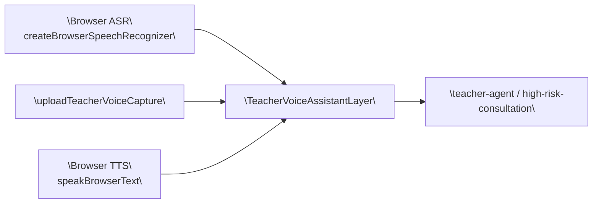

# SmartChildcare Agent 比赛开发文档技术图策划

更新日期：`2026-04-13`

这份文档不是泛泛的“建议放什么图”，而是把当前仓库里最值得放进比赛开发文档的代码截图和技术细节图，整理成可直接执行的截图清单。

目标只有一个：让评委看到 `桥接层`、`编排层`、`shared contracts`、`evidence chain`、`任务闭环` 这些工程化事实，而不是被零碎 UI 和实现噪声分散注意力。

## 1. 截图总原则

### 1.1 选图标准

- 一张图只证明一个核心观点，不把多个卖点硬塞到同一张截图里。
- 优先截 `一个完整函数`、`一个 route 分流段`、`一个 contract builder`。
- 优先截“输入如何进入系统、系统如何结构化处理、输出如何承接到下一层”。
- 代码图比 UI 图更重要；解释性数据流图比普通模块框图更重要。

### 1.2 裁剪规则

- 单张代码截图控制在 `35-70 行`。
- 如果同一个逻辑块超过 `70 行`，改成 `同文件双段拼图`，不要硬截成长图。
- 必须保留：函数名、关键输入组装、核心分支、结构化返回。
- 必须裁掉：`import`、长常量、重复 `map/filter`、样式代码、无关日志、测试桩、 mock 数据。
- 截图时保留行号，后续文档里可以直接引用。

### 1.3 图注模板

每张图的图注都按这个格式写：

`输入是什么 -> 这里做了什么结构化处理 -> 输出承接到哪里`

例子：

`教师端工作流请求先进入 Next API 桥接层，再补入 memory context 并按 workflow 分流，最终输出为 communication / follow-up / weekly-report 三类结构化结果。`

## 2. 代码截图清单

### C1. Teacher Copilot 的 Next API 桥接

- 文档章节：`系统总体架构与双层编排`
- 文件：`app/api/ai/teacher-agent/route.ts`
- 推荐裁剪：
  - 主图：`L69-L133`
  - 补图：`L136-L188`
  - 建议做成 `同页上下双段拼图`
- 截图重点：
  - `buildTeacherAgentClassContext` / `buildTeacherAgentChildContext`
  - `buildMemoryContextForPrompt`
  - `payload.workflow === "communication" | "follow-up" | "weekly-summary"`
  - `maybeRunHighRiskConsultation`
  - `NextResponse.json(...)`
- 适合原因：
  - 这张图最能证明前端不是“直接调模型”，而是通过 Next API 做统一桥接、分流和承接。
  - 同一段代码里同时出现 `memory context`、`workflow routing`、`consultation fallback`，评委一眼就能看出系统是有层次的。
- 图注建议：
  - `教师端请求先进入 Next API 桥接层，再补入 child/class context 和 memory context，最后按 communication、follow-up、weekly-summary 三个工作流输出结构化结果。`

### C2. Teacher Copilot 的理解链

- 文档章节：`Teacher Copilot`
- 文件：`backend/app/services/teacher_voice_understand.py`
- 推荐裁剪：`L40-L144`
- 截图重点：
  - `asr_provider.transcribe(...)`
  - `route_teacher_voice(...)`
  - `build_draft_items(...)`
  - `build_teacher_voice_copilot(...)`
  - `TeacherVoiceUnderstandResponse(...)`
- 适合原因：
  - 这不是单纯的 ASR 上传结果，而是“语音输入 -> router -> draft items -> copilot payload”的完整理解链。
  - 代码里同时保留了 `copilot` 和兼容字段，能证明你做过结构升级和兼容设计。
- 图注建议：
  - `教师语音先被转成 transcript，再进入 router 和 draft chain，最后产出 Teacher Copilot 所需的 record hints、micro SOP 和家长沟通脚本。`

### C3. 高风险会诊的 evidenceItems 构建

- 文档章节：`高风险会诊与证据链`
- 文件：`backend/app/services/high_risk_consultation_contract.py`
- 推荐裁剪：
  - 主图：`L426-L460`
  - 补图：`L463-L542`
  - 建议做成 `同页上下双段拼图`
- 截图重点：
  - `_build_evidence_item(...)`
  - `_normalize_evidence_items(...)`
  - `_build_consultation_evidence_items(...)`
  - `sourceType`、`supports`、`evidenceCategory`、`metadata.provenance`
- 适合原因：
  - 这是最能证明“结论不是拍脑袋”的代码图。
  - 它把会诊结论拆成可追溯的 evidence item，具备来源、分类、支撑关系、人工复核需求和 provenance 元数据。
- 图注建议：
  - `会诊结果不会直接以自然语言落地，而是先被归一成 evidenceItems，补齐来源分类、supports 和 provenance，再进入后续 trace 与 UI 承接。`

### C4. FastAPI 编排层的 memory + trace 注入

- 文档章节：`系统总体架构与双层编排`
- 文件：`backend/app/services/orchestrator.py`
- 推荐裁剪：
  - 主图：`L289-L330`
  - 补图：`L432-L502`
  - 建议做成 `左右双栏拼图`
- 截图重点：
  - `_build_trace_metadata(...)`
  - `_prepare_payload_with_memory(...)`
  - `memory_task` / `child_ids` / `_memory_trace_meta`
  - `workflow == "weekly-summary"`、`task == "weekly-report"`
- 适合原因：
  - 这张图证明 FastAPI 不是薄薄一层接口，而是会根据任务类型决定 memory task、child scope 和 trace metadata。
  - 它很适合拿来讲“后端编排层”而不是“后端接口层”。
- 图注建议：
  - `FastAPI orchestrator 会先根据 task/workflow 决定记忆上下文的装配方式，再把 memory trace metadata 注入 payload，保证同一工作流具备连续上下文。`

### C5. Weekly Report V2 的 actionized contract

- 文档章节：`Weekly Report V2 与家长趋势洞察`
- 文件：`lib/ai/weekly-report.ts`
- 推荐裁剪：
  - 主图：`L292-L333`
  - 补图：`L334-L380`
  - 建议做成 `同页上下双段拼图`
- 截图重点：
  - `buildWeeklyReportSections(...)`
  - `buildWeeklyReportPrimaryAction(...)`
  - `buildActionizedWeeklyReportResponse(...)`
  - `schemaVersion: "v2-actionized"`
  - `sections` / `primaryAction`
- 适合原因：
  - 这张图能直接证明 Weekly Report V2 已经不是“摘要文本”，而是角色化、分 section、带 primary action 的结构化 contract。
  - 评委能很快理解你做的是“可执行周报”，不是“好看的总结页”。
- 图注建议：
  - `Weekly Report V2 会按 teacher、admin、parent 三类角色生成不同 section，并额外抽取 primaryAction，把“周报”转成可执行的下周动作。`

### C6. Parent trend + structured feedback 的服务端汇总

- 文档章节：`Weekly Report V2 与家长趋势洞察`
- 文件：`backend/app/services/parent_trend_service.py`
- 推荐裁剪：
  - 主图：`L878-L957`
  - 补图：`L975-L1031`
  - 建议做成 `同页上下双段拼图`
- 截图重点：
  - `_resolve_window_days(...)`
  - `_resolve_intent(...)`
  - `_build_feedback_signal_bundle(...)`
  - `_maybe_extend_with_memory(...)`
  - `supportingSignals` / `dataQuality` / `warnings`
- 适合原因：
  - 这张图能证明家长趋势不是“问一句答一句”，而是基于时间窗、历史记录、反馈信号、age band 和 memory 的结构化推断。
  - `dataQuality` 和 `warnings` 很适合比赛文档里强调“系统知道自己什么时候不该过度自信”。
- 图注建议：
  - `家长趋势查询会先解析问题意图和时间窗，再融合历史记录、结构化反馈、age band 和 memory，最终输出 trendLabel、supportingSignals、dataQuality 与 warnings。`

### C7. follow-up 路由里的 feedback writeback 承接

- 文档章节：`canonical task / follow-up / feedback writeback`
- 文件：`app/api/ai/follow-up/route.ts`
- 推荐裁剪：
  - 主图：`L120-L190`
  - 补图：`L192-L235`
  - 建议做成 `同页上下双段拼图`
- 截图重点：
  - `buildTaskContext(payload)`
  - `selectStructuredFeedbackConsumption(...)`
  - `buildMemoryContextForPrompt(...)`
  - `taskAwarePayload`
  - `maybeRunHighRiskConsultation(...)`
- 适合原因：
  - 这张图最适合解释“反馈写回不是存一下就结束”，而是会重新影响 follow-up payload、memory continuity 和 consultation rerun。
  - 它把任务、反馈、记忆和会诊重新串成了闭环。
- 图注建议：
  - `follow-up route 会先把 active task 和 structured feedback 重新绑定，再把记忆上下文并入 payload，必要时重跑高风险会诊，形成真正可回流的闭环。`

### C8. canonical task 的落地模型

- 文档章节：`canonical task / follow-up / feedback writeback`
- 文件：`lib/tasks/task-model.ts`
- 推荐裁剪：
  - 主图：`L281-L327`
  - 可选补图：`L449-L518`
  - 主图单独成图；如果版面允许，再把补图作为“状态回填”补充图
- 截图重点：
  - `buildInterventionTasksFromCard(...)`
  - `parentTask` / `teacherTask`
  - `relatedTaskIds`
  - 可选补图里的 `collectEvidence(...)` / `hydrateTask(...)`
- 适合原因：
  - 这张图能直接证明一张 intervention card 不只是 UI，而是被物化成 parent / teacher 两类 canonical task。
  - 如果再补状态回填段，就能进一步证明任务状态不是手工维护，而是由 reminder、guardian feedback、check-in 等证据汇总得到。
- 图注建议：
  - `系统会把 intervention card 物化成家长执行任务和教师 follow-up 任务两条 canonical task，并通过 relatedTaskIds 保持闭环关联。`

## 3. 技术细节图清单

### T1. 双层编排与 shared contracts 总图

- 文档章节：`系统总体架构与双层编排`
- 依据代码：
  - `app/api/ai/teacher-agent/route.ts` `L69-L188`
  - `app/api/ai/follow-up/route.ts` `L120-L235`
  - `backend/app/services/orchestrator.py` `L289-L330` + `L432-L502`
  - `lib/teacher-copilot/types.ts` `L1-L41`
- 讲法重点：
  - 页面先进入 Next API 桥接层，再统一 forward 到 FastAPI orchestrator。
  - orchestrator 负责 memory + trace 注入，不同 service 再输出 shared contracts。
  - shared contracts 最后承接为 copilot card、weekly report、canonical task 等 UI/流程对象。


- 图注建议：
  - `SmartChildcare Agent 采用 Next API + FastAPI 的双层编排结构：前者负责桥接与分流，后者负责 memory/trace 编排，最终统一沉淀为 shared contracts 并回到前端卡片与任务流。`

### T2. 高风险会诊 evidence chain 图

- 文档章节：`高风险会诊与证据链`
- 依据代码：
  - `backend/app/services/high_risk_consultation_contract.py` `L426-L542`
  - `lib/consultation/evidence.ts` `L231-L340`
  - `lib/consultation/trace-view-model.ts` `L468-L690`
  - `components/admin/ConsultationTraceCard.tsx` `L295-L401`
- 讲法重点：
  - 输入不是单一来源，而是 teacher voice、guardian feedback、memory snapshot、trend 等多路信号。
  - evidenceItems 先被 contract 层标准化，再被 trace view model 分配到 stage。
  - Admin Trace Card 展示的是 evidence chain，不是只展示最终 summary。

```mermaid
flowchart LR
  signals["\"Teacher Note / Voice / Guardian Feedback / Trend / Memory\""]
  contract["\"_build_consultation_evidence_items\""]
  items["\"ConsultationEvidenceItem[]\\nsourceType / supports / metadata\""]
  trace["\"buildConsultationTraceViewModel\""]
  stage["\"stage evidence\\nlong_term / recent / recommendation\""]
  admin["\"ConsultationTraceCard / TraceStepCard\""]

  signals --> contract --> items --> trace --> stage --> admin
```

- 图注建议：
  - `高风险会诊并不是把多源输入拼成一句总结，而是先统一成 evidenceItems，再按 stage 组织成 evidence chain，最后落到 Admin Trace Card 展示。`

### T3. Weekly Report V2 到家长闭环的数据流图

- 文档章节：`Weekly Report V2 与家长趋势洞察`
- 依据代码：
  - `lib/ai/weekly-report.ts` `L292-L380`
  - `lib/agent/parent-weekly-report.ts` `L54-L156`
  - `backend/app/services/parent_trend_service.py` `L878-L1031`
  - `lib/feedback/consumption.ts` `L116-L272`
  - `app/api/ai/follow-up/route.ts` `L120-L235`
  - `lib/tasks/task-model.ts` `L281-L327` + `L449-L518`
- 讲法重点：
  - parent weekly snapshot 会消费 structured feedback，而不是忽略执行结果。
  - Weekly Report V2 把 summary 转成 `sections + primaryAction`。
  - 家长执行后的反馈再被 follow-up route 和 canonical task 重新消费，进入下一轮判断。

```mermaid
flowchart LR
  snapshot["\"buildParentWeeklyReportSnapshot\""]
  report["\"buildActionizedWeeklyReportResponse\""]
  action["\"primaryAction / nextWeekActions\""]
  feedback["\"Parent Structured Feedback\""]
  consume["\"selectStructuredFeedbackConsumption\""]
  followup["\"/api/ai/follow-up\""]
  task["\"buildInterventionTasksFromCard\\nCanonicalTask\""]
  nextRound["\"next context / next week\""]

  snapshot --> report --> action --> feedback --> consume --> followup --> task --> nextRound
```



- 图注建议：
  - `Weekly Report V2 不只是周报展示，而是从 parent weekly snapshot 生成 actionized report，再把家长执行反馈写回 follow-up 与 canonical task，形成真正的家校闭环。`

### T4. Care Mode / browser-first voice 阶段能力图

- 文档章节：`阶段性能力`
- 依据代码：
  - `components/teacher/TeacherVoiceAssistantLayer.tsx` `L753-L844`
  - `lib/voice/browser-speech-input.ts` `L146-L220`
  - `lib/voice/browser-tts.ts` `L69-L145`
  - `lib/mobile/voice-assistant-upload.ts` `L89-L145`
- 讲法重点：
  - 这部分只作为阶段能力展示，不要放到核心主线之前。
  - 重点是“browser-first + fallback”，而不是“我们做了语音功能”。
  - 适合讲成能力演进：浏览器能做的先做，上传链路和 mock fallback 保证 demo 可用。



- 图注建议：
  - `Care Mode / browser-first voice 采用“浏览器能力优先、上传链路兜底”的阶段化实现：浏览器先负责识别与播报，语音结果再承接到 teacher-agent 或高风险会诊工作流。`

## 4. 哪些代码不适合截图

- `lib/store.tsx`
  - 状态和演示数据过多，信息密度高但论证效率低，容易让评委看不出主线。
- `backend/app/db/demo_snapshot.py`
  - 更接近 seed/demo 数据，不适合证明工程能力。
- `components/parent/CareModeToggle.tsx`
  - 只是 UI 开关，不足以证明“阶段能力”背后的链路。
- `app/api/ai/parent-trend-query/route.ts`
  - 这类只有鉴权和转发的短 route 单独截图会显得太薄，只适合在架构图旁边做小佐证。
- `lib/teacher-copilot/normalize.ts`
  - 兼容层很重要，但全量截图像 parser plumbing，不适合作为正文主图。
- 测试文件、 mock provider、纯样式文件、长常量配置
  - 会降低“结构化、可讲、能证明工程化”的强度。

## 5. 文档章节安放顺序

1. `系统总体架构与双层编排`
   - 先放 `T1`
   - 再放 `C1`、`C4`
2. `Teacher Copilot`
   - 放 `C2`
   - 如果要强调全链路，再回引 `C1`
3. `高风险会诊与证据链`
   - 先放 `C3`
   - 再放 `T2`
4. `Weekly Report V2 与家长趋势洞察`
   - 放 `C5`、`C6`
   - 再放 `T3`
5. `canonical task / follow-up / feedback writeback`
   - 放 `C7`、`C8`
6. `阶段性能力`
   - 最后放 `T4`
   - 不建议提前到主线章节

## 6. 执行顺序建议

如果只够放 `6 张图`，优先顺序如下：

1. `C1` Teacher Copilot 的 Next API 桥接
2. `C3` 高风险会诊的 evidenceItems 构建
3. `C4` FastAPI 编排层的 memory + trace 注入
4. `C5` Weekly Report V2 的 actionized contract
5. `C7` follow-up 路由里的 feedback writeback 承接
6. `T2` 高风险会诊 evidence chain 图

如果能放完整 `12 张图`，就按本文件的顺序执行。

## 7. 交付时的版式建议

- 每一章最多放 `1 张技术图 + 2 张代码图`。
- 代码图一律统一主题、字号和缩放比例，避免比赛文档像“临时拼贴”。
- 同一章里如果有 `同文件双段拼图`，要明确标 `上：输入与分流`、`下：结构化输出与承接`。
- 不要给每张图都加大段解释；正文 2-3 句 + 图注 1 句足够。
- 评委第一眼要先看到 `层次`、`contract`、`闭环`，再看到“这个功能能做什么”。

## 8. 截图前 20 秒自检

- 如果一张图里看不到明确的输入、处理、输出三段关系，就不要截。
- 如果一张图需要你口头解释 1 分钟以上才能听懂，就说明它太碎或者太绕，应该换成更上层的 builder / route / contract。
- 如果代码超过 `70 行` 还想硬截，优先拆成 `同文件双段拼图`，不要生成长条截图。
- 如果图里的大多数内容都是样式、兼容分支、长数组、 mock 数据，就不是比赛正文图。
- 如果这张图不能回答“它证明了什么工程事实”，就不应该进入开发文档。
